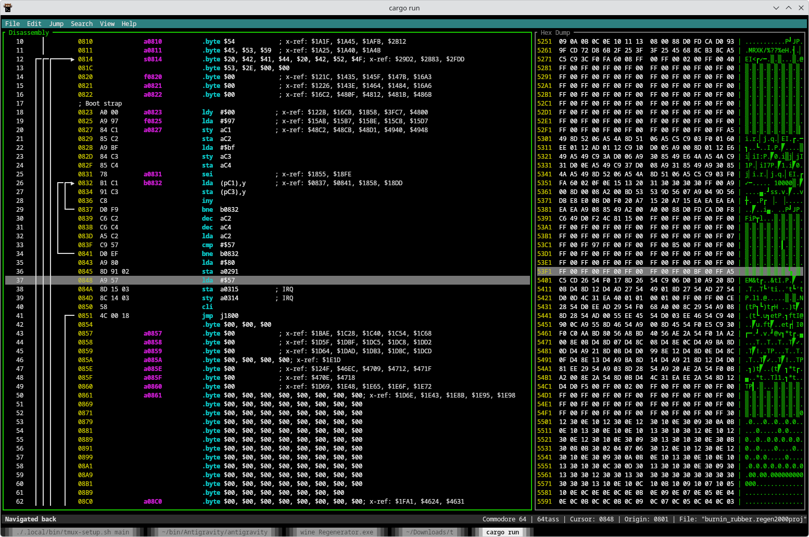

# Regenerator2000


A 6502 disassembler with a TUI. A modern take on [Regenerator][regenerator].

[regenerator]: https://csdb.dk/release/?id=247992

## Features

Regenerator2000 brings modern conveniences to 6502 disassembly:

- **Disassembly**: Full 6502 support including undocumented opcodes.
- **Hex View**:
  - Side-by-side view with disassembly.
  - Synchronized or independent navigation.
  - **PETSCII** support (Unshifted and Shifted modes).
- **Platforms**: Supports Commodore 8-bit machines like C64, C128, Plus/4, etc.
- **Import**: Load `.prg`, `.bin`, and `.regen2000proj` files.
- **Export**: Generate compatible assembly source code for:
  - **64tass**
  - **ACME**
- **Project Management**: Save and load your work with `.regen2000proj` files.
- **Analysis**: Auto-analysis to identify code and data regions.
- **Editing**:
  - **Labels**: Add, edit, and remove local and global labels.
  - **Data Types**: Convert regions to Code, Byte, Word, Address, Text, or Screencode.
  - **Undo/Redo**: Full history support for all actions.
- **Navigation**:
  - **Jump**: Go to specific addresses or follow operands.
  - **X-Ref**: Inspect cross-references for labels/addresses.
  - **History**: Navigate back to previous locations.
- **Customization**:
  - Configure document settings (max x-refs, platform, assembler).
  - Customizable display options (show/hide all labels, etc.).
- **TUI**:
  - Text User interface
  - Everything can be done from the keyboard



## Keyboard Shortcuts

| Context        | Action                       | Shortcut                          |
|:---------------|:-----------------------------|:----------------------------------|
| **Global**     | **Exit**                     | `Ctrl + Q`                        |
|                | **Open File**                | `Ctrl + O`                        |
|                | **Save Project**             | `Ctrl + S`                        |
|                | **Save Project As**          | `Ctrl + Shift + S`                |
|                | **Export ASM**               | `Ctrl + E`                        |
|                | **Export ASM As**            | `Ctrl + Shift + E`                |
|                | **Document Settings**        | `Ctrl + P`                        |
|                | **Undo**                     | `Ctrl + U` / `U`                  |
|                | **Redo**                     | `Ctrl + R`                        |
|                | **Switch Pane (Hex/Disasm)** | `Tab`                             |
| **View**       | **Zoom In**                  | `Ctrl + +` / `Ctrl + =`           |
|                | **Zoom Out**                 | `Ctrl + -`                        |
|                | **Reset Zoom**               | `Ctrl + 0`                        |
|                | **PETSCII Unshifted**        | `Ctrl + Shift + U`                |
|                | **PETSCII Shifted**          | `Ctrl + Shift + L`                |
| **Navigation** | **Move Cursor**              | `Up` / `Down` / `j` / `k`         |
|                | **Page Up/Down**             | `PageUp` / `PageDown`             |
|                | **Home/End**                 | `Home` / `End`                    |
|                | **Jump to Address**          | `g`                               |
|                | **Jump to Operand**          | `Enter`                           |
|                | **Jump Back (History)**      | `Backspace`                       |
|                | **Previous/Next 10 Lines**   | `Ctrl + u` / `Ctrl + d`           |
| **Editing**    | **Set Label**                | `l`                               |
|                | **Convert to Code**          | `c`                               |
|                | **Convert to Byte**          | `b`                               |
|                | **Convert to Word**          | `w`                               |
|                | **Convert to Address**       | `a`                               |
|                | **Convert to Text**          | `t`                               |
|                | **Convert to Screencode**    | `s`                               |
| **Selection**  | **Start Selection**          | `Shift + Up/Down` / `Shift + j/k` |
|                | **Clear Selection**          | `Esc`                             |
| **Menus**      | **Activate Menu**            | `F10`                             |
|                | **Navigate Menu**            | Arrows                            |
|                | **Select Item**              | `Enter`                           |
|                | **Close Menu**               | `Esc`                             |

## Build and Run

```bash
cargo run
```
