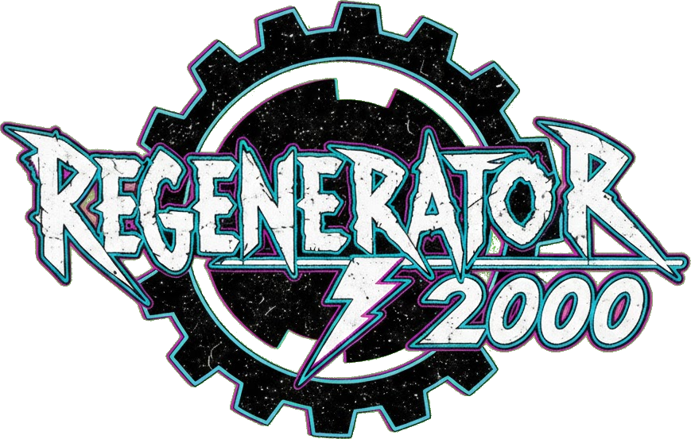

# Regenerator 2000



A 6502 disassembler with a TUI interface. A modern take on [Regenerator][regenerator].

[regenerator]: https://csdb.dk/release/?id=247992

## Features

Modern features not present in the original Regenerator:

- Undo / Redo
- Cross References

Common features:

- Disassemble 6502 code including undocumented opcodes
- Interactive TUI.
- Support for .bin and .prg files
- Export to 64tass

## Build and Run

```bash
cargo run
```
