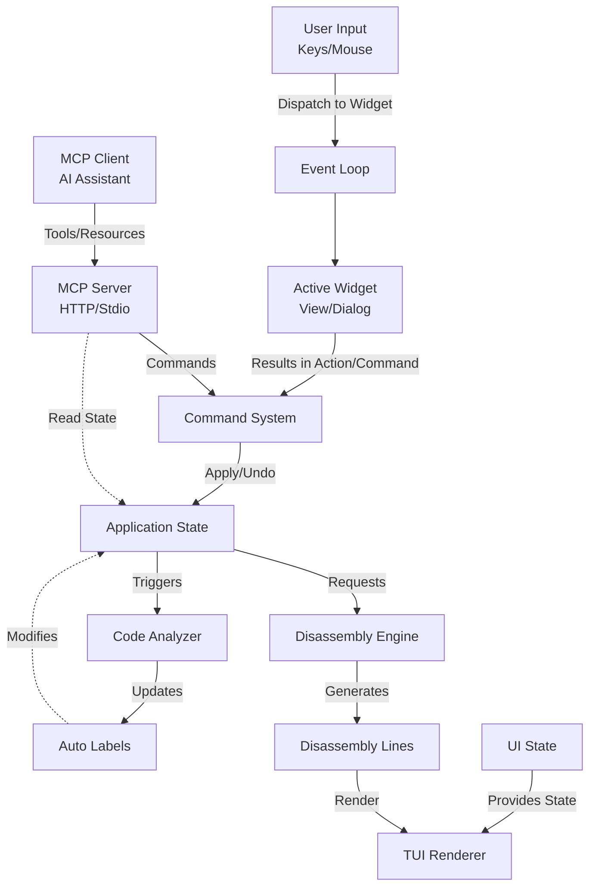

# Architecture

Regenerator 2000 is an interactive disassembler for the Commodore 64, written in Rust. It follows a unidirectional data flow architecture where user events modify the application state through commands, triggering re-analysis and re-rendering of the view.

## High-Level Overview



## Core Components

### 1. Application State ([`state/`](https://github.com/ricardoquesada/regenerator2000/tree/main/src/state))

The central hub of the application, organized across multiple modules:

- **[`app_state.rs`](https://github.com/ricardoquesada/regenerator2000/blob/main/src/state/app_state.rs)**: The main `AppState` struct that holds the runtime state, including:
  - **Undo Stack**: History of commands for Undo/Redo functionality.
  - **Disassembly Cache**: Used to avoid re-disassembling the entire file on every frame.
  - **Labels & Cross-References**: Auto-generated and user-defined labels with their cross-references.
- **[`project.rs`](https://github.com/ricardoquesada/regenerator2000/blob/main/src/state/project.rs)**: The `ProjectState` struct - the persistent part of the state (saved to .regen2000proj files), containing:
  - **Raw Data**: The binary being disassembled (gzip-compressed and base64-encoded for JSON serialization).
  - **Block Types**: Stored as run-length encoded blocks, defining how each byte should be interpreted (Code, DataByte, DataWord, Address, Text, Screencode, LoHi, HiLo, ExternalFile, Undefined).
  - **User Comments**: Side comments and line comments.
  - **Immediate Value Formats**: Custom formatting for immediate values (hex, decimal, binary, high/low byte references).
  - **Cursor Positions**: Saved cursor positions for each view (disassembly, hex dump, sprites, charset, bitmap).
  - **View Settings**: Saved state for multicolor modes and right pane visibility.
- **[`settings.rs`](https://github.com/ricardoquesada/regenerator2000/blob/main/src/state/settings.rs)**: Document settings (part of ProjectState) including:
  - Assembler selection (64tass, ACME, ca65, KickAssembler)
  - Platform selection (C64, C128, VIC-20, Plus/4, PET, 1541)
  - Text line length, BRK handling, illegal opcodes support
  - Display preferences (max xref count, arrow columns, etc.)
  - Enabled platform-specific features
- **[`types.rs`](https://github.com/ricardoquesada/regenerator2000/blob/main/src/state/types.rs)**: Core type definitions used throughout the state module (BlockType, ImmediateFormat, Label, etc.).

### 2. Disassembly Engine ([`disassembler/`](https://github.com/ricardoquesada/regenerator2000/tree/main/src/disassembler))

Responsible for converting raw bytes into human-readable assembly code based on the state.

- **[`disassembler.rs`](https://github.com/ricardoquesada/regenerator2000/blob/main/src/disassembler.rs)**: The main driver. It iterates through the raw data, respecting `BlockType` definitions, and produces a list of `DisassemblyLine`s.
- **[`formatter.rs`](https://github.com/ricardoquesada/regenerator2000/blob/main/src/disassembler/formatter.rs)**: A trait abstracting the differences between assembler syntaxes.
- **[`formatter_acme.rs`](https://github.com/ricardoquesada/regenerator2000/blob/main/src/disassembler/formatter_acme.rs)**: ACME assembler implementation.
- **[`formatter_64tass.rs`](https://github.com/ricardoquesada/regenerator2000/blob/main/src/disassembler/formatter_64tass.rs)**: 64tass assembler implementation.
- **[`formatter_ca65.rs`](https://github.com/ricardoquesada/regenerator2000/blob/main/src/disassembler/formatter_ca65.rs)**: ca65 (cc65 suite) assembler implementation.
- **[`formatter_kickasm.rs`](https://github.com/ricardoquesada/regenerator2000/blob/main/src/disassembler/formatter_kickasm.rs)**: KickAssembler implementation.

### 3. CPU Model ([`cpu.rs`](https://github.com/ricardoquesada/regenerator2000/blob/main/src/cpu.rs))

Provides the domain model for the MOS 6502/6510 CPU.

- **`Opcode`**: Definitions of all supported opcodes, including cycle counts, addressing modes, and descriptions.
- **`AddressingMode`**: Enum defining the different addressing modes (Absolute, ZeroPage, Immediate, etc.).
  Used by both the **Disassembler** (to decode instructions) and the **Analyzer** (to understand control flow).

### 4. Command System ([`commands.rs`](https://github.com/ricardoquesada/regenerator2000/blob/main/src/commands.rs))

Implements the **Command Pattern**. Granular actions (e.g., `SetBlockType`, `SetLabel`) are encapsulated as Structs that know how to:

- **Apply**: Execute the change on `AppState`.
- **Undo**: Revert the change.
  This enables robust Undo/Redo functionality and ensures state consistency.

### 5. Analyzer ([`analyzer.rs`](https://github.com/ricardoquesada/regenerator2000/blob/main/src/analyzer.rs))

A heuristic engine that runs after state changes. It:

- Traces code paths (following JMPs and branches).
- Identifies referenced addresses.
- Auto-generates labels (e.g., `j_loop_0400`) based on usage context (subroutine, branch target, pointer).

### 6. Parser ([`parser/`](https://github.com/ricardoquesada/regenerator2000/tree/main/src/parser))

Handles importing various Commodore 64 file formats and label files.

- **[`parser.rs`](https://github.com/ricardoquesada/regenerator2000/blob/main/src/parser.rs)**: Module definition.
- **[`crt.rs`](https://github.com/ricardoquesada/regenerator2000/blob/main/src/parser/crt.rs)**: Parser for Commodore 64 cartridge (.crt) files.
- **[`t64.rs`](https://github.com/ricardoquesada/regenerator2000/blob/main/src/parser/t64.rs)**: Parser for T64 tape archive files.
- **[`vice_lbl.rs`](https://github.com/ricardoquesada/regenerator2000/blob/main/src/parser/vice_lbl.rs)**: Parser for VICE label files (for importing debug symbols).
- **[`vice_vsf.rs`](https://github.com/ricardoquesada/regenerator2000/blob/main/src/parser/vice_vsf.rs)**: Parser for VICE snapshot files (.vsf).

These parsers allow Regenerator 2000 to load programs from multiple source formats and import debugging symbols from VICE emulator sessions.

### 7. Exporter ([`exporter.rs`](https://github.com/ricardoquesada/regenerator2000/blob/main/src/exporter.rs))

Handles the generation of complete, compilable source code files.

- Supports multiple assembler formats (ACME, 64tass, ca65, KickAssembler) via the `Formatter` trait.
- Ensures output validity by checking for label collisions and handling syntax-specific requirements.

### 8. UI Architecture

The UI is built on `crossterm` and `ratatui` with a custom `Widget` trait abstraction.

- **`Widget` Trait** ([`ui/widget.rs`](https://github.com/ricardoquesada/regenerator2000/blob/main/src/ui/widget.rs)):
  Defines the interface for all UI components (Views, Dialogs, Menu, StatusBar).

  ```rust
  pub trait Widget {
      fn render(&self, f: &mut Frame, area: Rect, app_state: &AppState, ui_state: &mut UIState);
      fn handle_input(&mut self, key: KeyEvent, app_state: &mut AppState, ui_state: &mut UIState) -> WidgetResult;
      fn handle_mouse(&mut self, mouse: MouseEvent, app_state: &mut AppState, ui_state: &mut UIState) -> WidgetResult;
  }
  ```

- **Core UI Components**:
  - **[`main.rs`](https://github.com/ricardoquesada/regenerator2000/blob/main/src/main.rs)**: Initializes the terminal and event loop.
  - **[`events.rs`](https://github.com/ricardoquesada/regenerator2000/blob/main/src/events.rs)**: The primary event loop and rendering coordinator. Synchronizes view states and manages the main application loop.
  - **[`events/input.rs`](https://github.com/ricardoquesada/regenerator2000/blob/main/src/events/input.rs)**: The input router. It determines the active pane and dispatches input events (keyboard and mouse) to the corresponding `Widget`.
  - **[`ui.rs`](https://github.com/ricardoquesada/regenerator2000/blob/main/src/ui.rs)**: The top-level layout engine. It renders the Menu, StatusBar, and the active Main View.

- **Main Views** ([`ui/view_*.rs`](https://github.com/ricardoquesada/regenerator2000/tree/main/src/ui)):
  - **[`view_disassembly.rs`](https://github.com/ricardoquesada/regenerator2000/blob/main/src/ui/view_disassembly.rs)**: The primary disassembly listing view with syntax highlighting and navigation.
  - **[`view_hexdump.rs`](https://github.com/ricardoquesada/regenerator2000/blob/main/src/ui/view_hexdump.rs)**: Hexadecimal dump view with multiple display modes (PETSCII, Screencode).
  - **[`view_sprites.rs`](https://github.com/ricardoquesada/regenerator2000/blob/main/src/ui/view_sprites.rs)**: Visual sprite editor/viewer for C64 sprite data.
  - **[`view_charset.rs`](https://github.com/ricardoquesada/regenerator2000/blob/main/src/ui/view_charset.rs)**: Character set editor/viewer for font data.
  - **[`view_bitmap.rs`](https://github.com/ricardoquesada/regenerator2000/blob/main/src/ui/view_bitmap.rs)**: Bitmap graphics viewer for hires and multicolor bitmaps.
  - **[`view_blocks.rs`](https://github.com/ricardoquesada/regenerator2000/blob/main/src/ui/view_blocks.rs)**: Block type overview showing the memory layout.

- **Dialogs** ([`ui/dialog_*.rs`](https://github.com/ricardoquesada/regenerator2000/tree/main/src/ui)):
  - **[`dialog_about.rs`](https://github.com/ricardoquesada/regenerator2000/blob/main/src/ui/dialog_about.rs)**: About/help dialog.
  - **[`dialog_comment.rs`](https://github.com/ricardoquesada/regenerator2000/blob/main/src/ui/dialog_comment.rs)**: Add/edit comments.
  - **[`dialog_complete_address.rs`](https://github.com/ricardoquesada/regenerator2000/blob/main/src/ui/dialog_complete_address.rs)**: Complete missing byte for Hi/Lo or Lo/Hi address packing when only one immediate value is available.
  - **[`dialog_confirmation.rs`](https://github.com/ricardoquesada/regenerator2000/blob/main/src/ui/dialog_confirmation.rs)**: Generic confirmation dialog.
  - **[`dialog_d64_picker.rs`](https://github.com/ricardoquesada/regenerator2000/blob/main/src/ui/dialog_d64_picker.rs)**: D64 disk image file picker for loading programs from disk images.
  - **[`dialog_document_settings.rs`](https://github.com/ricardoquesada/regenerator2000/blob/main/src/ui/dialog_document_settings.rs)**: Project-level settings editor.
  - **[`dialog_export_as.rs`](https://github.com/ricardoquesada/regenerator2000/blob/main/src/ui/dialog_export_as.rs)**: Export source code dialog.
  - **[`dialog_export_labels.rs`](https://github.com/ricardoquesada/regenerator2000/blob/main/src/ui/dialog_export_labels.rs)**: Export labels to VICE format.
  - **[`dialog_find_references.rs`](https://github.com/ricardoquesada/regenerator2000/blob/main/src/ui/dialog_find_references.rs)**: Find cross-references to an address.
  - **[`dialog_go_to_symbol.rs`](https://github.com/ricardoquesada/regenerator2000/blob/main/src/ui/dialog_go_to_symbol.rs)**: Navigate to a label by name.
  - **[`dialog_jump_to_address.rs`](https://github.com/ricardoquesada/regenerator2000/blob/main/src/ui/dialog_jump_to_address.rs)**: Jump to a specific memory address.
  - **[`dialog_jump_to_line.rs`](https://github.com/ricardoquesada/regenerator2000/blob/main/src/ui/dialog_jump_to_line.rs)**: Jump to a specific line number.
  - **[`dialog_keyboard_shortcut.rs`](https://github.com/ricardoquesada/regenerator2000/blob/main/src/ui/dialog_keyboard_shortcut.rs)**: Keyboard shortcuts reference.
  - **[`dialog_label.rs`](https://github.com/ricardoquesada/regenerator2000/blob/main/src/ui/dialog_label.rs)**: Add/edit labels.
  - **[`dialog_open.rs`](https://github.com/ricardoquesada/regenerator2000/blob/main/src/ui/dialog_open.rs)**: Open file browser.
  - **[`dialog_origin.rs`](https://github.com/ricardoquesada/regenerator2000/blob/main/src/ui/dialog_origin.rs)**: Set the load address.
  - **[`dialog_save_as.rs`](https://github.com/ricardoquesada/regenerator2000/blob/main/src/ui/dialog_save_as.rs)**: Save project dialog.
  - **[`dialog_search.rs`](https://github.com/ricardoquesada/regenerator2000/blob/main/src/ui/dialog_search.rs)**: Search for bytes or text.
  - **[`dialog_settings.rs`](https://github.com/ricardoquesada/regenerator2000/blob/main/src/ui/dialog_settings.rs)**: Application-level settings.
  - **[`dialog_warning.rs`](https://github.com/ricardoquesada/regenerator2000/blob/main/src/ui/dialog_warning.rs)**: Generic warning dialog for displaying important messages to the user.

- **UI State Management ([`ui_state.rs`](https://github.com/ricardoquesada/regenerator2000/blob/main/src/ui_state.rs))**:
  Tracks transient interface state:
  - **Active Pane**: Enum (`Disassembly`, `HexDump`, `Sprites`, `Charset`, `Bitmap`, `Blocks`) identifying the focused tool.
  - **Right Pane**: Enum defining which view is shown in the right-side panel.
  - **Active Dialog**: `Option<Box<dyn Widget>>` allowing modal dialogs to take over input and rendering.
  - **View State**: Cursor positions, scroll offsets, selection ranges, and view-specific modes (e.g., Hexdump PETSCII/Screencode modes, multicolor modes for sprites/charset/bitmap).
  - **Visual Mode**: Vim-like visual selection mode.
  - **Search State**: Vim-like search functionality with search history.
  - **Theme**: Current color theme for the UI.
  - **Layout Areas**: Cached rectangles for mouse interaction detection.

### 9. Theme System ([`theme.rs`](https://github.com/ricardoquesada/regenerator2000/blob/main/src/theme.rs))

Provides customizable color schemes for the UI.

- Defines color palettes for different UI elements (dialogs, menus, status bar, syntax highlighting).
- Supports multiple built-in themes.
- Allows users to customize the appearance of the application.

### 10. Configuration ([`config.rs`](https://github.com/ricardoquesada/regenerator2000/blob/main/src/config.rs))

Manages system-level configuration that persists across sessions.

- **`SystemConfig`**: User preferences including:
  - Theme selection
  - View synchronization settings (sync hex dump, sprites, charset with disassembly)
  - Window/layout preferences
- Stored separately from project state to maintain user preferences across different projects.

### 11. Assets ([`assets.rs`](https://github.com/ricardoquesada/regenerator2000/blob/main/src/assets.rs))

Handles embedded assets like the application logo and other static resources used in the UI.

### 12. MCP Server ([`mcp/`](https://github.com/ricardoquesada/regenerator2000/tree/main/src/mcp))

Implements the Model Context Protocol (MCP) server for programmatic access to Regenerator 2000.

- **[`mod.rs`](https://github.com/ricardoquesada/regenerator2000/blob/main/src/mcp/mod.rs)**: Core MCP server implementation.
- **[`stdio.rs`](https://github.com/ricardoquesada/regenerator2000/blob/main/src/mcp/stdio.rs)**: Stdio transport mode for MCP communication.
- **HTTP Mode**: Supports Server-Sent Events (SSE) over HTTP on port 3000.
- **Stdio Mode**: Headless subprocess mode for AI assistants like Claude Desktop.

The MCP server exposes tools and resources allowing AI agents to:

- **Tools**: Manipulate disassembly (set labels, comments, block types), search memory, manage cross-references, save projects, and perform undo/redo operations.
- **Resources**: Access binary data, disassembly views, hexdump views, and selected regions.

This enables collaborative human-AI workflows where both can work on the same project simultaneously (HTTP mode) or fully automated analysis sessions (stdio mode).

### 13. Utilities ([`utils.rs`](https://github.com/ricardoquesada/regenerator2000/blob/main/src/utils.rs))

Contains shared helper functions and utilities used across the application.

## Data Flow

1. **Input**: User presses a key (e.g., `C`) or interacts with the mouse.
2. **Dispatch**: [`events/input.rs`](https://github.com/ricardoquesada/regenerator2000/blob/main/src/events/input.rs) routes the input to the active `Widget` (e.g., `DisassemblyView`, or an active dialog).
3. **Action**: The Widget processes the input via `handle_input()` or `handle_mouse()` and returns a `WidgetResult::Action` (e.g., `MenuAction::Code`).
4. **Execution**: The action is converted into a `Command` (e.g., `SetBlockType`), pushed to the `UndoStack`, and applied to `AppState`.
5. **Update**: `AppState` modifies the data (e.g., updates `BlockType` array).
6. **Analysis**: The change triggers [`analyzer.rs`](https://github.com/ricardoquesada/regenerator2000/blob/main/src/analyzer.rs) to re-scan the code.
7. **Disassembly**: `AppState` calls `Disassembler::disassemble()` to regenerate the cached `DisassemblyLine`s.
8. **Synchronization**: [`events.rs`](https://github.com/ricardoquesada/regenerator2000/blob/main/src/events.rs) synchronizes view states (e.g., if hex dump sync is enabled, the hex cursor follows the disassembly cursor).
9. **Render**: The main loop calls `ui::draw()`, which asks every visible `Widget` to render itself based on the new `AppState`.

## Persistence

Projects are saved as JSON files (`.regen2000proj`).

- **Structure**: Serializes the `ProjectState` struct.
- **Efficiency**:
  - Raw data is gzip-compressed and base64-encoded to reduce file size.
  - Block types use run-length encoding to compress long sequences of the same type.
- **Portability**: Designed to be portable across different machines, storing relative paths where possible.
- **Session State**: Cursor positions and view settings are saved with the project for seamless session restoration.
