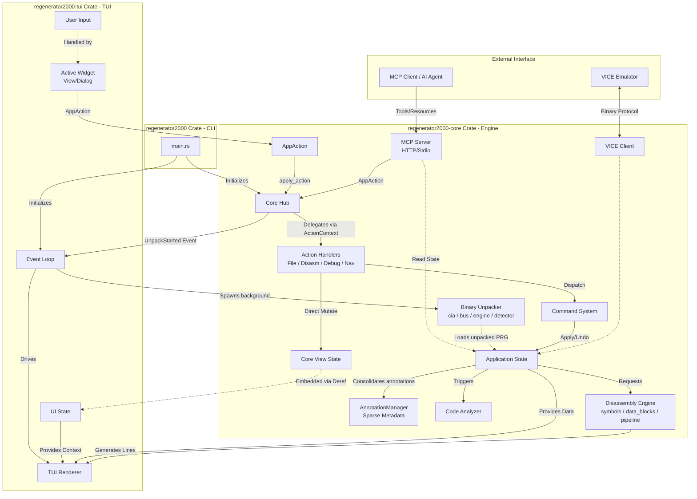

# Architecture

Regenerator 2000 is an interactive disassembler for 8-bit Commodore computers (C64, C128, VIC-20, Plus/4, PET, 1541),
written in Rust. It follows a unidirectional data flow architecture where user events modify the application state
through commands, triggering re-analysis and re-rendering of the view.

## High-Level Overview


```mermaid
flowchart TD
    subgraph bin [regenerator2000 Crate - CLI]
        Main[main.rs]
    end

    subgraph tui_crate [regenerator2000-tui Crate - TUI]
        Input[User Input]
        EventLoop[Event Loop]
        Widget[Active Widget<br/>View/Dialog]
        Renderer[TUI Renderer]
        UIState[UI State]
    end

    subgraph core_crate [regenerator2000-core Crate - Engine]
        Core[Core Hub]
        ActionHandlers[Action Handlers<br/>File / Disasm / Debug / Nav]
        Action[AppAction]
        CommandSys[Command System]
        AppState[Application State]
        AnnotationMap[AnnotationManager<br/>Sparse Metadata]
        CoreViewState[Core View State]
        Analyzer[Code Analyzer]
        DisasmEngine[Disassembly Engine<br/>symbols / data_blocks / pipeline]
        ViceClient[VICE Client]
        MCPServer[MCP Server<br/>HTTP/Stdio]
        Unpacker[Binary Unpacker<br/>cia / bus / engine / detector]
    end

    subgraph External [External Interface]
        MCPClient[MCP Client / AI Agent]
        VICE[VICE Emulator]
    end

    Main -->|Initializes| Core
    Main -->|Initializes| EventLoop
    Input -->|Handled by| Widget
    EventLoop -->|Drives| Renderer
    Widget -->|AppAction| Action
    Action -->|apply_action| Core
    Core -->|Delegates via ActionContext| ActionHandlers

    MCPClient -->|Tools/Resources| MCPServer
    MCPServer -->|AppAction| Core
    MCPServer -.->|Read State| AppState

    ActionHandlers -->|Dispatch| CommandSys
    ActionHandlers -->|Direct Mutate| CoreViewState
    Core -->|UnpackStarted Event| EventLoop
    EventLoop -->|Spawns background| Unpacker
    Unpacker -.->|Loads unpacked PRG| AppState

    CommandSys -->|Apply/Undo| AppState
    AppState -->|Consolidates annotations| AnnotationMap

    AppState -->|Requests| DisasmEngine
    AppState -->|Triggers| Analyzer

    CoreViewState -.->|Embedded via Deref| UIState
    UIState -->|Provides Context| Renderer
    AppState -->|Provides Data| Renderer
    DisasmEngine -->|Generates Lines| Renderer

    VICE <-->|Binary Protocol| ViceClient
    ViceClient -.-> AppState
```

## Workspace Structure

The project is organized as a Cargo workspace with three primary components:

1. **[`regenerator2000-core`](https://github.com/ricardoquesada/regenerator2000/tree/main/crates/regenerator2000-core)
   **: The head-less engine. Contains all memory management, disassembly logic, CPU tables, analysis heuristics,
   cross-frontend view state, binary unpackers, and the MCP server.
2. **[`regenerator2000-tui`](https://github.com/ricardoquesada/regenerator2000/tree/main/crates/regenerator2000-tui)**:
   The TUI library. Implements the `ratatui` widgets, event loop coordination, and theme system.
3. **[`regenerator2000`](https://github.com/ricardoquesada/regenerator2000/tree/main/src)** (root): The binary crate.
   Provides the CLI entry point, initializes the terminal, and links the core engine with the TUI frontend.

## Core Components

### 1. Application State & Logic ([`regenerator2000-core/src/state/`](https://github.com/ricardoquesada/regenerator2000/tree/main/crates/regenerator2000-core/src/state) & [`src/action_handlers/`](https://github.com/ricardoquesada/regenerator2000/tree/main/crates/regenerator2000-core/src/action_handlers))

The core engine state, organized across multiple domain modules:

- **[`core.rs`](https://github.com/ricardoquesada/regenerator2000/blob/main/crates/regenerator2000-core/src/core.rs)**:
  The central `Core` hub. Orchestrates persistent state (`AppState`) and transient view state (`CoreViewState`).
  Delegates `apply_action()` execution to SRP action handlers via `ActionContext<'a>`.
- **[`action_handlers/`](https://github.com/ricardoquesada/regenerator2000/tree/main/crates/regenerator2000-core/src/action_handlers)**:
  Modular action dispatchers that process domain actions cleanly:
  - **`file_handler.rs`**: File loading, saving, importing, project reset, and assembler export.
  - **`disassembly_handler.rs`**: Block type toggling, comment editing, label assignment, and scope creation.
  - **`debug_handler.rs`**: VICE monitor connection, breakpoint/watchpoint management, and execution stepping.
  - **`navigation_handler.rs`**: Address jumps, symbol navigation, bookmarking, and history stack pushing.
- **[`app_state.rs`](https://github.com/ricardoquesada/regenerator2000/blob/main/crates/regenerator2000-core/src/state/app_state.rs)**:
  The main `AppState` struct that holds runtime data. Contains the Undo Stack, Disassembly Cache, system configuration,
  annotations (`AnnotationManager`), cross-references (`cross_refs`), and connection state for VICE.
- **[`annotations.rs`](https://github.com/ricardoquesada/regenerator2000/blob/main/crates/regenerator2000-core/src/state/annotations.rs)**:
  Unified sparse address metadata manager (`AnnotationManager` & `AddressEntry`). Replaces parallel `BTreeMap` address structures with a single sparse annotation map, automatically normalizing empty strings, pruning empty nodes, and maintaining 100% legacy `.regen2000proj` JSON project backward compatibility via `#[serde(flatten)]`.
- **[`types.rs`](https://github.com/ricardoquesada/regenerator2000/blob/main/crates/regenerator2000-core/src/state/types.rs)**:
  Domain types including zero-cost `TargetSystem` discriminant enum (`C64`, `C128`, `Vic20`, `Plus4`, `Pet20`, `Pet40`, `Pet80`, `C1541`, `C1571`, `C1581`, `Custom`), `Addr`, `BlockType`, `Assembler`, `LabelType`, etc.
- **[`error.rs`](https://github.com/ricardoquesada/regenerator2000/blob/main/crates/regenerator2000-core/src/error.rs)**:
  Domain error hierarchy (`CoreError` via `thiserror`) with subsystem variants (`UnpackError`, `ExportError`, `ViceError`, `ProjectError`) and path-tracking context extension (`IoResultExt`).
- **[`view_state.rs`](https://github.com/ricardoquesada/regenerator2000/blob/main/crates/regenerator2000-core/src/view_state.rs)**:
  Defines `CoreViewState` — the frontend-agnostic representation of cursor positions, selections, and active panes.
- **[`actions.rs`](https://github.com/ricardoquesada/regenerator2000/blob/main/crates/regenerator2000-core/src/state/actions.rs)**:
  Defines the `AppAction` enum — semantic actions that any frontend (TUI, GUI, Web, MCP) can produce.
- **[`blocks.rs`](https://github.com/ricardoquesada/regenerator2000/blob/main/crates/regenerator2000-core/src/state/blocks.rs)**:
  Block management logic (Code, Data, Text, etc.) and memory layout queries.
- **[`file_io.rs`](https://github.com/ricardoquesada/regenerator2000/blob/main/crates/regenerator2000-core/src/state/file_io.rs)**:
  Loading and importing of various formats into `AppState`.
- **[`navigation.rs`](https://github.com/ricardoquesada/regenerator2000/blob/main/crates/regenerator2000-core/src/navigation.rs)**:
  Pure navigation helpers (jumping to addresses, creating save contexts) that operate on `AppState` + `CoreViewState`.
- **[`project.rs`](https://github.com/ricardoquesada/regenerator2000/blob/main/crates/regenerator2000-core/src/state/project.rs)**:
  The `ProjectState` struct — the persistent state saved to `.regen2000proj` files. Flattens `annotations: AnnotationManager` for backward compatibility.
- **[`settings.rs`](https://github.com/ricardoquesada/regenerator2000/blob/main/crates/regenerator2000-core/src/state/settings.rs)**:
  Document-level settings (assembler, system, display preferences, fill run threshold).
- **[`search.rs`](https://github.com/ricardoquesada/regenerator2000/blob/main/crates/regenerator2000-core/src/state/search.rs)**:
  Centralized search logic (hex, text, PETSCII).
- **[`event.rs`](https://github.com/ricardoquesada/regenerator2000/blob/main/crates/regenerator2000-core/src/event.rs)**:
  Defines `CoreEvent` (state changes, dialog requests, status messages) and `DialogType` — the frontend-agnostic event vocabulary returned by `Core::apply_action()`.

### 2. Disassembly Engine ([`regenerator2000-core/src/disassembler/`](https://github.com/ricardoquesada/regenerator2000/tree/main/crates/regenerator2000-core/src/disassembler))

Responsible for converting raw bytes into human-readable assembly code based on the state. Structured as a 4-module subsystem:

- **[`mod.rs`](https://github.com/ricardoquesada/regenerator2000/blob/main/crates/regenerator2000-core/src/disassembler/mod.rs)**:
  Public API facade. Re-exports `DisassemblyContext`, `HandleArgs`, `format_cross_references`, `resolve_label`, `resolve_label_name`, `Disassembler`, `DisassemblyLine`, `LABEL_COLUMN_WIDTH`, and `DEFINITION_COLUMN_WIDTH` with 100% backward compatibility.
- **[`pipeline.rs`](https://github.com/ricardoquesada/regenerator2000/blob/main/crates/regenerator2000-core/src/disassembler/pipeline.rs)**:
  Main `disassemble_ctx` decoding loop and instruction execution pipeline (`disassemble_code_instruction`).
- **[`data_blocks.rs`](https://github.com/ricardoquesada/regenerator2000/blob/main/crates/regenerator2000-core/src/disassembler/data_blocks.rs)**:
  Formatters for non-instruction memory blocks (`disassemble_bytes`, `disassemble_words`, `disassemble_addresses`, `disassemble_petscii`, `disassemble_screencode`, `disassemble_external_file`, `disassemble_partial_data`, `disassemble_fill_run`).
- **[`symbols.rs`](https://github.com/ricardoquesada/regenerator2000/blob/main/crates/regenerator2000-core/src/disassembler/symbols.rs)**:
  Symbol priority precedence (`User` > `System` > `Auto`), scope name resolution (`compute_scope_names`), local label scanning (`compute_local_label_names`), and instruction target address lookups.
- **[`context.rs`](https://github.com/ricardoquesada/regenerator2000/blob/main/crates/regenerator2000-core/src/disassembler/context.rs)**:
  The `DisassemblyContext` struct bundling binary data, block types, labels, annotations, cross-refs, and pre-computed scope boundaries for $O(\log S)$ virtual splitter checks.
- **[`handlers.rs`](https://github.com/ricardoquesada/regenerator2000/blob/main/crates/regenerator2000-core/src/disassembler/handlers.rs)**:
  Addressing mode operand formatting handlers.
- **[`formatter.rs`](https://github.com/ricardoquesada/regenerator2000/blob/main/crates/regenerator2000-core/src/disassembler/formatter.rs)**:
  A trait abstracting differences between assembler syntaxes (`TassFormatter`, `AcmeFormatter`, `Ca65Formatter`, `KickAsmFormatter`).

### 3. CPU Model ([`regenerator2000-core/src/cpu.rs`](https://github.com/ricardoquesada/regenerator2000/blob/main/crates/regenerator2000-core/src/cpu.rs))

Provides the domain model for the MOS 6502/6510 CPU.

- **`Opcode`**: Definitions of all supported opcodes, including cycle counts, addressing modes, and descriptions.
- **`AddressingMode`**: Enum defining the different addressing modes (Absolute, ZeroPage, Immediate, etc.).
  Used by both the **Disassembler** (to decode instructions) and the **Analyzer** (to understand control flow).

### 4. Command System ([`regenerator2000-core/src/commands.rs`](https://github.com/ricardoquesada/regenerator2000/blob/main/crates/regenerator2000-core/src/commands.rs))

Implements the **Command Pattern**. Granular actions (e.g., `SetBlockType`, `SetLabel`) are encapsulated as Structs that
know how to:

- **Apply**: Execute the change on `AppState`.
- **Undo**: Revert the change.
  This enables robust Undo/Redo functionality and ensures state consistency.

### 5. Analyzer ([`regenerator2000-core/src/analyzer.rs`](https://github.com/ricardoquesada/regenerator2000/blob/main/crates/regenerator2000-core/src/analyzer.rs))

A heuristic engine that runs after state changes. It:

- Traces code paths (following JMPs and branches).
- Identifies referenced addresses.
- Identifies and marks fill sequences based on the "Fill run threshold" setting.
- Auto-generates labels (e.g., `s_C000`, `j_0400`, `zpf_A0`) based on usage context (subroutine, branch, jump, pointer,
  field). See [Analysis — Label Prefixes](analysis.md#label-prefixes) for the complete prefix reference.

### 6. Parser ([`regenerator2000-core/src/parser/`](https://github.com/ricardoquesada/regenerator2000/tree/main/crates/regenerator2000-core/src/parser))

Handles importing various Commodore file formats and label files.

- **[`parser.rs`](https://github.com/ricardoquesada/regenerator2000/blob/main/crates/regenerator2000-core/src/parser.rs)
  **: Module re-exports for all parser sub-modules.
- **[`prg.rs`](https://github.com/ricardoquesada/regenerator2000/blob/main/crates/regenerator2000-core/src/parser/prg.rs)
  **: Parser for standard Commodore PRG files (2-byte load address header). Also parses embedded BASIC SYS addresses to
  suggest entry points.
- **[`crt.rs`](https://github.com/ricardoquesada/regenerator2000/blob/main/crates/regenerator2000-core/src/parser/crt.rs)
  **: Parser for Commodore 64 cartridge (.crt) files with multi-bank chip selection.
- **[`d64.rs`](https://github.com/ricardoquesada/regenerator2000/blob/main/crates/regenerator2000-core/src/parser/d64.rs)
  **: Unified parser for D64 (35/40/42-track), D71 (70/80-track), and D81 disk image files. Supports file extraction
  from 1541/1571/1581 disk images.
- **[`t64.rs`](https://github.com/ricardoquesada/regenerator2000/blob/main/crates/regenerator2000-core/src/parser/t64.rs)
  **: Parser for T64 tape archive files.
- **[`dis65.rs`](https://github.com/ricardoquesada/regenerator2000/blob/main/crates/regenerator2000-core/src/parser/dis65.rs)
  **: Parser for 6502bench SourceGen (.dis65) project files.
- **[`vice_lbl.rs`](https://github.com/ricardoquesada/regenerator2000/blob/main/crates/regenerator2000-core/src/parser/vice_lbl.rs)
  **: Parser for VICE label files (.lbl) for importing debug symbols.
- **[`vice_vsf.rs`](https://github.com/ricardoquesada/regenerator2000/blob/main/crates/regenerator2000-core/src/parser/vice_vsf.rs)
  **: Parser for VICE snapshot files (.vsf). Auto-detects the system from the VSF header.

### 7. Exporter ([`regenerator2000-core/src/exporter/`](https://github.com/ricardoquesada/regenerator2000/tree/main/crates/regenerator2000-core/src/exporter))

Handles generation of complete, compilable source code and browsable HTML disassembly files.

- **[`asm.rs`](https://github.com/ricardoquesada/regenerator2000/blob/main/crates/regenerator2000-core/src/exporter/asm.rs)
  **: Exports disassembly as a compilable assembly source file. Supports all four assembler formats (ACME, 64tass, ca65,
  KickAssembler) via the `Formatter` trait, and handles external-file (`incbin`) regions.
- **[`html.rs`](https://github.com/ricardoquesada/regenerator2000/blob/main/crates/regenerator2000-core/src/exporter/html.rs)
  **: Exports disassembly as a self-contained, syntax-highlighted HTML file with clickable cross-reference hyperlinks,
  light/dark theme toggle, and assembler-specific build instructions in the header. `ExternalFile` regions are written
  to separate linked HTML files.
- **[`verify.rs`](https://github.com/ricardoquesada/regenerator2000/blob/main/crates/regenerator2000-core/src/exporter/verify.rs)
  **: Export→assemble→diff roundtrip verification. Exports ASM, invokes the real assembler binary, and byte-compares the
  output against the original binary to confirm disassembly correctness. Supports all four assemblers.

### 8. Binary Unpacker ([`regenerator2000-core/src/unpacker/`](https://github.com/ricardoquesada/regenerator2000/tree/main/crates/regenerator2000-core/src/unpacker) & [`regenerator2000-core/src/packers/`](https://github.com/ricardoquesada/regenerator2000/tree/main/crates/regenerator2000-core/src/packers))

Provides an accurate 6502 emulation sandbox to automatically decompress packed Commodore 64 programs. Structured as a 5-module subsystem:

- **[`mod.rs`](https://github.com/ricardoquesada/regenerator2000/blob/main/crates/regenerator2000-core/src/unpacker/mod.rs)**:
  Public API facade re-exporting `unpack`, `UnpackConfig`, `UnpackResult`, `UnpackerMemory`, `C64Bus`, `UnpackError`, and `find_sys_address`.
- **[`cia.rs`](https://github.com/ricardoquesada/regenerator2000/blob/main/crates/regenerator2000-core/src/unpacker/cia.rs)**:
  `CiaState` MOS 6526 CIA 1 & CIA 2 timer state emulation and cycle-accurate stepping (`step_cycles`).
- **[`bus.rs`](https://github.com/ricardoquesada/regenerator2000/blob/main/crates/regenerator2000-core/src/unpacker/bus.rs)**:
  `C64Bus` (`UnpackerMemory`), $00/$01 processor port, ROM banking, and I/O chip redirection with safe checked ROM lookups.
- **[`engine.rs`](https://github.com/ricardoquesada/regenerator2000/blob/main/crates/regenerator2000-core/src/unpacker/engine.rs)**:
  2-Phase 6502 execution loop with instruction step hooks and ROM trap handling.
- **[`detector.rs`](https://github.com/ricardoquesada/regenerator2000/blob/main/crates/regenerator2000-core/src/unpacker/detector.rs)**:
  Pure memory range diffing, snapshot matching, and trailing cluster trimming heuristics.
- **Strategy Pattern Architecture**: Uses a trait-based `Packer` strategy pattern (`Box<dyn Packer>`) where each supported packer lives in its own dedicated module under `src/packers/` (e.g., `exomizer.rs`, `dali.rs`, `pucrunch.rs`).

### 9. UI Architecture

The UI is built on `crossterm` and `ratatui` with a custom `Widget` trait abstraction.

- **`Widget` Trait** ([`regenerator2000-tui/src/ui/widget.rs`](https://github.com/ricardoquesada/regenerator2000/blob/main/crates/regenerator2000-tui/src/ui/widget.rs)):
  Defines the interface for all UI components (Views, Dialogs, Menu, StatusBar).

  ```rust
  pub trait Widget {
      fn render(&self, f: &mut Frame, area: Rect, app_state: &AppState, ui_state: &mut UIState);
      fn handle_input(&mut self, key: KeyEvent, app_state: &mut AppState, ui_state: &mut UIState) -> WidgetResult;
      // Default implementation returns WidgetResult::Ignored
      fn handle_mouse(&mut self, mouse: MouseEvent, app_state: &mut AppState, ui_state: &mut UIState) -> WidgetResult;
  }
  ```

- **Core UI Components**:
  - **[`main.rs`](https://github.com/ricardoquesada/regenerator2000/blob/main/src/main.rs)**: Initializes the terminal and event loop.
  - **[`events.rs`](https://github.com/ricardoquesada/regenerator2000/blob/main/crates/regenerator2000-tui/src/events.rs)**: The primary event loop and rendering coordinator.
  - **[`events/input.rs`](https://github.com/ricardoquesada/regenerator2000/blob/main/crates/regenerator2000-tui/src/events/input.rs)**: Input router dispatching keyboard and mouse events to active `Widget`.
  - **[`ui.rs`](https://github.com/ricardoquesada/regenerator2000/blob/main/crates/regenerator2000-tui/src/ui.rs)**: Top-level layout engine.

- **Menu System** ([`regenerator2000-tui/src/ui/menu/`](https://github.com/ricardoquesada/regenerator2000/tree/main/crates/regenerator2000-tui/src/ui/menu))
- **Main Views** ([`regenerator2000-tui/src/ui/view_*.rs`](https://github.com/ricardoquesada/regenerator2000/tree/main/crates/regenerator2000-tui/src/ui))
- **Dialogs** ([`regenerator2000-tui/src/ui/dialog_*.rs`](https://github.com/ricardoquesada/regenerator2000/tree/main/crates/regenerator2000-tui/src/ui))

### 10. Theme System ([`regenerator2000-tui/src/theme.rs`](https://github.com/ricardoquesada/regenerator2000/blob/main/crates/regenerator2000-tui/src/theme.rs))

Provides customizable TOML-based color schemes for the UI.

### 11. Configuration ([`regenerator2000-core/src/config.rs`](https://github.com/ricardoquesada/regenerator2000/blob/main/crates/regenerator2000-core/src/config.rs))

Manages application-level configuration (`config.toml`) persisting preferences across sessions.

### 12. Assets ([`regenerator2000-core/src/assets.rs`](https://github.com/ricardoquesada/regenerator2000/blob/main/crates/regenerator2000-core/src/assets.rs))

Manages embedded system definition files (`system-*.toml`) and theme files (`theme-*.toml`).

### 13. MCP Server ([`regenerator2000-core/src/mcp/`](https://github.com/ricardoquesada/regenerator2000/tree/main/crates/regenerator2000-core/src/mcp))

Implements the Model Context Protocol (MCP) server for programmatic access via HTTP (SSE) and Stdio transports.

### 14. VICE Integration ([`regenerator2000-core/src/vice/`](https://github.com/ricardoquesada/regenerator2000/tree/main/crates/regenerator2000-core/src/vice))

Provides live debugging integration with the VICE emulator.

### 15. Utilities ([`regenerator2000-core/src/utils.rs`](https://github.com/ricardoquesada/regenerator2000/blob/main/crates/regenerator2000-core/src/utils.rs))

Contains shared helper functions and utilities used across the application.

## Data Flow

1. **Input**: User presses a key (e.g., `C`) or interacts with the mouse.
2. **Dispatch**: [`regenerator2000-tui/src/events/input.rs`](https://github.com/ricardoquesada/regenerator2000/blob/main/crates/regenerator2000-tui/src/events/input.rs) routes input to active `Widget`.
3. **Action**: Widget processes input and returns `AppAction`.
4. **Core Application**: TUI calls `Core::apply_action(action)`.
5. **Execution**: `Core` delegates to `ActionHandlers` (`ActionContext<'a>`), converting actions into `Command` applications on `AppState` or updating `CoreViewState`.
6. **Side Effects**: State changes trigger `analyzer.rs` or re-generate disassembly via `disassembler/`.
7. **Events**: `Core::apply_action` returns a list of `CoreEvent`s.
8. **UI Sync**: TUI updates `UIState` (opening dialogs, syncing cursors, status messages).
9. **Render**: Main loop calls `ui::draw()`, rendering the TUI from `AppState` and `UIState`.

## Persistence

Projects are saved as JSON files (`.regen2000proj`).

- **Structure**: Serializes `ProjectState` struct.
- **Sparse Metadata**: `AnnotationManager` is flattened (`#[serde(flatten)]`) to maintain 100% backward compatibility with legacy project files while consolidating address annotations.
- **Compression**: Raw data is gzip-compressed and base64-encoded; block types use run-length encoding.
- **Portability**: Relative paths stored for cross-machine portability.
