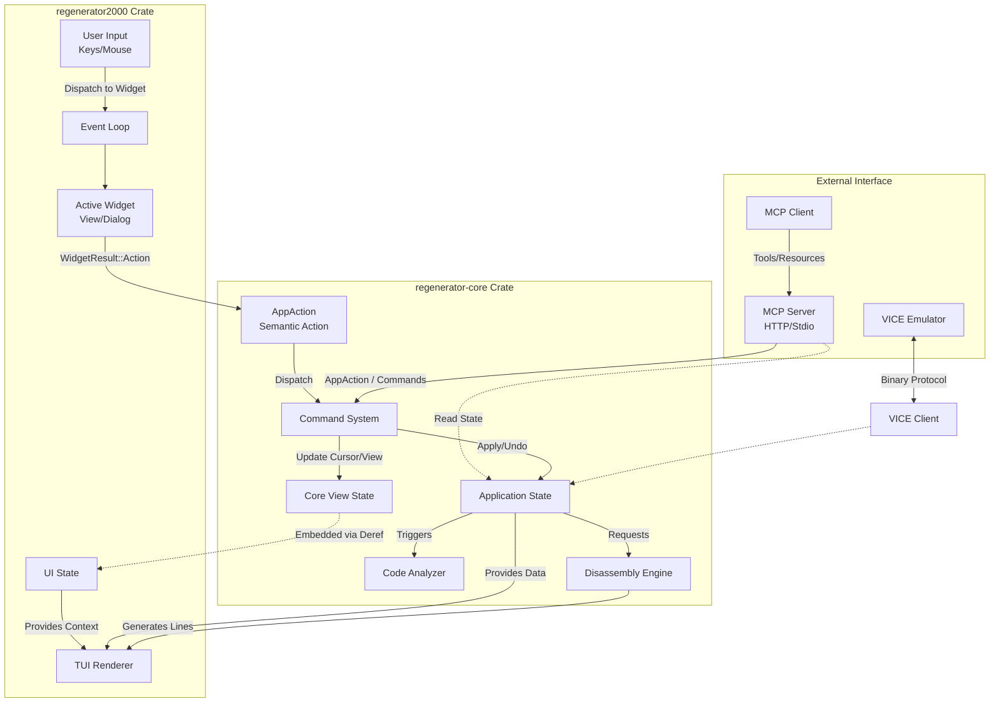

# Architecture

Regenerator 2000 is an interactive disassembler for 8-bit Commodore computers (C64, C128, VIC-20, Plus/4, PET, 1541), written in Rust. It follows a unidirectional data flow architecture where user events modify the application state through commands, triggering re-analysis and re-rendering of the view.

## High-Level Overview


```mermaid
flowchart TD
    subgraph r2k [regenerator2000 Crate]
        Input[User Input<br/>Keys/Mouse]
        EventLoop[Event Loop]
        Widget[Active Widget<br/>View/Dialog]
        Renderer[TUI Renderer]
        UIState[UI State]
    end

    subgraph core [regenerator-core Crate]
        Action[AppAction<br/>Semantic Action]
        CommandSys[Command System]
        AppState[Application State]
        CoreViewState[Core View State]
        Analyzer[Code Analyzer]
        DisasmEngine[Disassembly Engine]
    end

    subgraph Interface [External Interface]
        MCPClient[MCP Client]
        MCPServer[MCP Server<br/>HTTP/Stdio]
        VICE[VICE Emulator]
    end

    Input -->|Dispatch to Widget| EventLoop
    EventLoop --> Widget
    Widget -->|WidgetResult::Action| Action
    Action -->|Dispatch| CommandSys

    MCPClient -->|Tools/Resources| MCPServer
    MCPServer -->|AppAction / Commands| CommandSys
    MCPServer -.->|Read State| AppState

    CommandSys -->|Apply/Undo| AppState
    CommandSys -->|Update Cursor/View| CoreViewState

    AppState -->|Requests| DisasmEngine
    AppState -->|Triggers| Analyzer

    CoreViewState -.->|Embedded via Deref| UIState
    UIState -->|Provides Context| Renderer
    AppState -->|Provides Data| Renderer
    DisasmEngine -->|Generates Lines| Renderer

    VICE <-->|Binary Protocol| ViceClient[VICE Client]
    ViceClient -.-> AppState
```

## Workspace Structure

The project is organized as a Cargo workspace with two primary crates:

1.  **[`regenerator-core`](https://github.com/ricardoquesada/regenerator2000/tree/main/crates/regenerator-core)**: The head-less engine. Contains all memory management, disassembly logic, CPU tables, analysis heuristics, and cross-frontend view state.
2.  **[`regenerator2000`](https://github.com/ricardoquesada/regenerator2000/tree/main/src)** (root): The TUI frontend. Implements the `ratatui` interface, event loop, theme system, and MCP server transports.

## Core Components

### 1. Application State & Logic ([`regenerator-core/src/state/`](https://github.com/ricardoquesada/regenerator2000/tree/main/crates/regenerator-core/src/state))

The core engine state, organized across multiple modules:

- **[`app_state.rs`](https://github.com/ricardoquesada/regenerator2000/blob/main/crates/regenerator-core/src/state/app_state.rs)**: The main `AppState` struct that holds the runtime data hub. Contains the Undo Stack, Disassembly Cache, and connection state for VICE.
- **[`view_state.rs`](https://github.com/ricardoquesada/regenerator2000/blob/main/crates/regenerator-core/src/state/view_state.rs)**: Defines `CoreViewState` — the frontend-agnostic representation of cursor positions, selections, and active panes.
- **[`actions.rs`](https://github.com/ricardoquesada/regenerator2000/blob/main/crates/regenerator-core/src/state/actions.rs)**: Defines the `AppAction` enum — semantic actions that any frontend (TUI, GUI, Web, MCP) can produce.
- **[`blocks.rs`](https://github.com/ricardoquesada/regenerator2000/blob/main/crates/regenerator-core/src/state/blocks.rs)**: Block management logic (Code, Data, Text, etc.) and memory layout queries.
- **[`disassembly.rs`](https://github.com/ricardoquesada/regenerator2000/blob/main/crates/regenerator-core/src/state/disassembly.rs)**: Disassembly orchestration and line-index lookups.
- **[`navigation.rs`](https://github.com/ricardoquesada/regenerator2000/blob/main/crates/regenerator-core/src/navigation.rs)**: Pure navigation helpers (jumping to addresses, creating save contexts) that operate on `AppState` + `CoreViewState`.
- **[`project.rs`](https://github.com/ricardoquesada/regenerator2000/blob/main/crates/regenerator-core/src/state/project.rs)**: The `ProjectState` struct — the persistent part of the state saved to `.regen2000proj` files.
- **[`settings.rs`](https://github.com/ricardoquesada/regenerator2000/blob/main/crates/regenerator-core/src/state/settings.rs)**: Document-level settings (assembler, platform, display preferences).
- **[`search.rs`](https://github.com/ricardoquesada/regenerator2000/blob/main/crates/regenerator-core/src/state/search.rs)**: Centralized search logic (hex, text, PETSCII).
- **[`types.rs`](https://github.com/ricardoquesada/regenerator2000/blob/main/crates/regenerator-core/src/state/types.rs)**: Core type definitions used across the workspace.

### 2. Disassembly Engine ([`regenerator-core/src/disassembler/`](https://github.com/ricardoquesada/regenerator2000/tree/main/crates/regenerator-core/src/disassembler))

Responsible for converting raw bytes into human-readable assembly code based on the state.

- **[`disassembler.rs`](https://github.com/ricardoquesada/regenerator2000/blob/main/crates/regenerator-core/src/disassembler.rs)**: The main driver. It iterates through the raw data, respecting `BlockType` definitions, and produces a list of `DisassemblyLine`s.
- **[`context.rs`](https://github.com/ricardoquesada/regenerator2000/blob/main/crates/regenerator-core/src/disassembler/context.rs)**: The `DisassemblyContext` struct that bundles all data needed for a disassembly pass (binary data, block types, labels, comments, cross-refs, analysis hints, etc.).
- **[`handlers.rs`](https://github.com/ricardoquesada/regenerator2000/blob/main/crates/regenerator-core/src/disassembler/handlers.rs)**: Helper functions for disassembling specific block types (e.g., data bytes, words, addresses, text, screencodes).
- **[`formatter.rs`](https://github.com/ricardoquesada/regenerator2000/blob/main/crates/regenerator-core/src/disassembler/formatter.rs)**: A trait abstracting the differences between assembler syntaxes.
- **[`formatter_acme.rs`](https://github.com/ricardoquesada/regenerator2000/blob/main/crates/regenerator-core/src/disassembler/formatter_acme.rs)**: ACME assembler implementation.
- **[`formatter_64tass.rs`](https://github.com/ricardoquesada/regenerator2000/blob/main/crates/regenerator-core/src/disassembler/formatter_64tass.rs)**: 64tass assembler implementation.
- **[`formatter_ca65.rs`](https://github.com/ricardoquesada/regenerator2000/blob/main/crates/regenerator-core/src/disassembler/formatter_ca65.rs)**: ca65 (cc65 suite) assembler implementation.
- **[`formatter_kickasm.rs`](https://github.com/ricardoquesada/regenerator2000/blob/main/crates/regenerator-core/src/disassembler/formatter_kickasm.rs)**: KickAssembler implementation.

### 3. CPU Model ([`regenerator-core/src/cpu.rs`](https://github.com/ricardoquesada/regenerator2000/blob/main/crates/regenerator-core/src/cpu.rs))

Provides the domain model for the MOS 6502/6510 CPU.

- **`Opcode`**: Definitions of all supported opcodes, including cycle counts, addressing modes, and descriptions.
- **`AddressingMode`**: Enum defining the different addressing modes (Absolute, ZeroPage, Immediate, etc.).
  Used by both the **Disassembler** (to decode instructions) and the **Analyzer** (to understand control flow).

### 4. Command System ([`regenerator-core/src/commands.rs`](https://github.com/ricardoquesada/regenerator2000/blob/main/crates/regenerator-core/src/commands.rs))

Implements the **Command Pattern**. Granular actions (e.g., `SetBlockType`, `SetLabel`) are encapsulated as Structs that know how to:

- **Apply**: Execute the change on `AppState`.
- **Undo**: Revert the change.
  This enables robust Undo/Redo functionality and ensures state consistency.

### 5. Analyzer ([`regenerator-core/src/analyzer.rs`](https://github.com/ricardoquesada/regenerator2000/blob/main/crates/regenerator-core/src/analyzer.rs))

A heuristic engine that runs after state changes. It:

- Traces code paths (following JMPs and branches).
- Identifies referenced addresses.
- Auto-generates labels (e.g., `j_loop_0400`) based on usage context (subroutine, branch target, pointer).

### 6. Parser ([`regenerator-core/src/parser/`](https://github.com/ricardoquesada/regenerator2000/tree/main/crates/regenerator-core/src/parser))

Handles importing various Commodore file formats and label files.

- **[`crt.rs`](https://github.com/ricardoquesada/regenerator2000/blob/main/crates/regenerator-core/src/parser/crt.rs)**: Parser for Commodore 64 cartridge (.crt) files.
- **[`d64.rs`](https://github.com/ricardoquesada/regenerator2000/blob/main/crates/regenerator-core/src/parser/d64.rs)**: Parser for D64 disk image files, supporting file extraction from 1541 disk images.
- **[`t64.rs`](https://github.com/ricardoquesada/regenerator2000/blob/main/crates/regenerator-core/src/parser/t64.rs)**: Parser for T64 tape archive files.
- **[`vice_lbl.rs`](https://github.com/ricardoquesada/regenerator2000/blob/main/crates/regenerator-core/src/parser/vice_lbl.rs)**: Parser for VICE label files (for importing debug symbols).
- **[`vice_vsf.rs`](https://github.com/ricardoquesada/regenerator2000/blob/main/crates/regenerator-core/src/parser/vice_vsf.rs)**: Parser for VICE snapshot files (.vsf).

These parsers allow Regenerator 2000 to load programs from multiple source formats (PRG, CRT, D64, T64, VSF) and import debugging symbols from VICE emulator sessions.

### 7. Exporter ([`regenerator-core/src/exporter.rs`](https://github.com/ricardoquesada/regenerator2000/blob/main/crates/regenerator-core/src/exporter.rs))

Handles the generation of complete, compilable source code files.

- Supports multiple assembler formats (ACME, 64tass, ca65, KickAssembler) via the `Formatter` trait.
- Ensures output validity by checking for label collisions and handling syntax-specific requirements.

### 8. UI Architecture

The UI is built on `crossterm` and `ratatui` with a custom `Widget` trait abstraction.

- **`Widget` Trait** ([`src/ui/widget.rs`](https://github.com/ricardoquesada/regenerator2000/blob/main/src/ui/widget.rs)):
  Defines the interface for all UI components (Views, Dialogs, Menu, StatusBar).

  ```rust
  pub trait Widget {
      fn render(&self, f: &mut Frame, area: Rect, app_state: &AppState, ui_state: &mut UIState);
      fn handle_input(&mut self, key: KeyEvent, app_state: &mut AppState, ui_state: &mut UIState) -> WidgetResult;
      // Default implementation returns WidgetResult::Ignored
      fn handle_mouse(&mut self, mouse: MouseEvent, app_state: &mut AppState, ui_state: &mut UIState) -> WidgetResult;
  }
  ```

- **Core UI Components**:
  - **[`main.rs`](https://github.com/ricardoquesada/regenerator2000/blob/main/src/main.rs)**: Initializes the terminal and event loop.
  - **[`events.rs`](https://github.com/ricardoquesada/regenerator2000/blob/main/src/events.rs)**: The primary event loop and rendering coordinator. Synchronizes view states and manages the main application loop.
  - **[`events/input.rs`](https://github.com/ricardoquesada/regenerator2000/blob/main/src/events/input.rs)**: The input router. It determines the active pane and dispatches input events (keyboard and mouse) to the corresponding `Widget`.
  - **[`ui.rs`](https://github.com/ricardoquesada/regenerator2000/blob/main/src/ui/ui.rs)**: The top-level layout engine. It renders the Menu, StatusBar, and the active Main View.
  - **[`statusbar.rs`](https://github.com/ricardoquesada/regenerator2000/blob/main/src/ui/statusbar.rs)**: Bottom status bar showing cursor address, block type, and context info.
  - **[`navigable.rs`](https://github.com/ricardoquesada/regenerator2000/blob/main/src/ui/navigable.rs)**: Shared trait/helpers for views that support cursor-based navigation.
  - **[`graphics_common.rs`](https://github.com/ricardoquesada/regenerator2000/blob/main/src/ui/graphics_common.rs)**: Shared rendering logic for graphical views (sprites, charset, bitmap).

- **Menu System** ([`src/ui/menu/`](https://github.com/ricardoquesada/regenerator2000/tree/main/src/ui/menu)):
  The menu bar is split across several sub-modules:
  - **[`mod.rs`](https://github.com/ricardoquesada/regenerator2000/blob/main/src/ui/menu/mod.rs)**: The `Menu` struct implementing `Widget`, handling keyboard and mouse interaction with the menu bar and popup menus.
  - **[`menu_action.rs`](https://github.com/ricardoquesada/regenerator2000/blob/main/src/ui/menu/menu_action.rs)**: Action dispatch logic — routes `AppAction` variants to `Command` applications, dialog creation, and other side effects.
  - **[`menu_model.rs`](https://github.com/ricardoquesada/regenerator2000/blob/main/src/ui/menu/menu_model.rs)**: Data model for the menu system: `MenuState`, `MenuCategory`, and `MenuItem` structs with keyboard shortcut bindings.
  - **[`menu_render.rs`](https://github.com/ricardoquesada/regenerator2000/blob/main/src/ui/menu/menu_render.rs)**: Rendering functions for the menu bar and popup menus.

- **Main Views** ([`src/ui/view_*.rs`](https://github.com/ricardoquesada/regenerator2000/tree/main/src/ui)):
  - **[`view_disassembly.rs`](https://github.com/ricardoquesada/regenerator2000/blob/main/src/ui/view_disassembly.rs)**: The primary disassembly listing view with syntax highlighting and navigation.
  - **[`view_hexdump.rs`](https://github.com/ricardoquesada/regenerator2000/blob/main/src/ui/view_hexdump.rs)**: Hexadecimal dump view with multiple display modes (PETSCII, Screencode).
  - **[`view_sprites.rs`](https://github.com/ricardoquesada/regenerator2000/blob/main/src/ui/view_sprites.rs)**: Visual sprite editor/viewer for C64 sprite data.
  - **[`view_charset.rs`](https://github.com/ricardoquesada/regenerator2000/blob/main/src/ui/view_charset.rs)**: Character set editor/viewer for font data.
  - **[`view_bitmap.rs`](https://github.com/ricardoquesada/regenerator2000/blob/main/src/ui/view_bitmap.rs)**: Bitmap graphics viewer for hires and multicolor bitmaps.
  - **[`view_blocks.rs`](https://github.com/ricardoquesada/regenerator2000/blob/main/src/ui/view_blocks.rs)**: Block type overview showing the memory layout.
  - **[`view_debugger.rs`](https://github.com/ricardoquesada/regenerator2000/blob/main/src/ui/view_debugger.rs)**: Live debugging view for VICE integration.

- **Dialogs** ([`src/ui/dialog_*.rs`](https://github.com/ricardoquesada/regenerator2000/tree/main/src/ui)):
  - **[`dialog_about.rs`](https://github.com/ricardoquesada/regenerator2000/blob/main/src/ui/dialog_about.rs)**: About/help dialog.
  - **[`dialog_bookmarks.rs`](https://github.com/ricardoquesada/regenerator2000/blob/main/src/ui/dialog_bookmarks.rs)**: Bookmark manager for navigating saved addresses.
  - **[`dialog_breakpoint_address.rs`](https://github.com/ricardoquesada/regenerator2000/blob/main/src/ui/dialog_breakpoint_address.rs)**: Set breakpoint address for VICE debugging.
  - **[`dialog_comment.rs`](https://github.com/ricardoquesada/regenerator2000/blob/main/src/ui/dialog_comment.rs)**: Add/edit comments.
  - **[`dialog_complete_address.rs`](https://github.com/ricardoquesada/regenerator2000/blob/main/src/ui/dialog_complete_address.rs)**: Complete missing byte for Hi/Lo or Lo/Hi address packing when only one immediate value is available.
  - **[`dialog_confirmation.rs`](https://github.com/ricardoquesada/regenerator2000/blob/main/src/ui/dialog_confirmation.rs)**: Generic confirmation dialog.
  - **[`dialog_crt_picker.rs`](https://github.com/ricardoquesada/regenerator2000/blob/main/src/ui/dialog_crt_picker.rs)**: CRT cartridge chip/bank picker for selecting which chip to load from multi-chip cartridges.
  - **[`dialog_d64_picker.rs`](https://github.com/ricardoquesada/regenerator2000/blob/main/src/ui/dialog_d64_picker.rs)**: D64 disk image file picker for loading programs from disk images.
  - **[`dialog_document_settings.rs`](https://github.com/ricardoquesada/regenerator2000/blob/main/src/ui/dialog_document_settings.rs)**: Project-level settings editor.
  - **[`dialog_export_as.rs`](https://github.com/ricardoquesada/regenerator2000/blob/main/src/ui/dialog_export_as.rs)**: Export source code dialog.
  - **[`dialog_export_labels.rs`](https://github.com/ricardoquesada/regenerator2000/blob/main/src/ui/dialog_export_labels.rs)**: Export labels to VICE format.
  - **[`dialog_find_references.rs`](https://github.com/ricardoquesada/regenerator2000/blob/main/src/ui/dialog_find_references.rs)**: Find cross-references to an address.
  - **[`dialog_go_to_symbol.rs`](https://github.com/ricardoquesada/regenerator2000/blob/main/src/ui/dialog_go_to_symbol.rs)**: Navigate to a label by name.
  - **[`dialog_jump_to_address.rs`](https://github.com/ricardoquesada/regenerator2000/blob/main/src/ui/dialog_jump_to_address.rs)**: Jump to a specific memory address.
  - **[`dialog_jump_to_line.rs`](https://github.com/ricardoquesada/regenerator2000/blob/main/src/ui/dialog_jump_to_line.rs)**: Jump to a specific line number.
  - **[`dialog_keyboard_shortcut.rs`](https://github.com/ricardoquesada/regenerator2000/blob/main/src/ui/dialog_keyboard_shortcut.rs)**: Keyboard shortcuts reference.
  - **[`dialog_label.rs`](https://github.com/ricardoquesada/regenerator2000/blob/main/src/ui/dialog_label.rs)**: Add/edit labels.
  - **[`dialog_open.rs`](https://github.com/ricardoquesada/regenerator2000/blob/main/src/ui/dialog_open.rs)**: Open file browser.
  - **[`dialog_open_recent.rs`](https://github.com/ricardoquesada/regenerator2000/blob/main/src/ui/dialog_open_recent.rs)**: Open recent projects list.
  - **[`dialog_origin.rs`](https://github.com/ricardoquesada/regenerator2000/blob/main/src/ui/dialog_origin.rs)**: Set the load address.
  - **[`dialog_save_as.rs`](https://github.com/ricardoquesada/regenerator2000/blob/main/src/ui/dialog_save_as.rs)**: Save project dialog.
  - **[`dialog_search.rs`](https://github.com/ricardoquesada/regenerator2000/blob/main/src/ui/dialog_search.rs)**: Search for bytes or text.
  - **[`dialog_settings.rs`](https://github.com/ricardoquesada/regenerator2000/blob/main/src/ui/dialog_settings.rs)**: Application-level settings.
  - **[`dialog_t64_picker.rs`](https://github.com/ricardoquesada/regenerator2000/blob/main/src/ui/dialog_t64_picker.rs)**: T64 tape archive file picker for selecting which entry to load.
  - **[`dialog_vice_connect.rs`](https://github.com/ricardoquesada/regenerator2000/blob/main/src/ui/dialog_vice_connect.rs)**: Configures connection to VICE's remote monitor.
  - **[`dialog_warning.rs`](https://github.com/ricardoquesada/regenerator2000/blob/main/src/ui/dialog_warning.rs)**: Generic warning dialog for displaying important messages to the user.
  - **[`dialog_watchpoint_address.rs`](https://github.com/ricardoquesada/regenerator2000/blob/main/src/ui/dialog_watchpoint_address.rs)**: Set watchpoint address for VICE debugging (memory read/write breakpoints).

- **UI State Management ([`ui_state.rs`](file:///Users/ricardoq/progs/regenerator2000/src/ui_state.rs))**:
  The TUI-specific interface state. It embeds a `CoreViewState` via the `.core` field and uses **`Deref`/`DerefMut`** to allow direct access to core view state (like `cursor_index`) from the UI layer.
  - **Active Dialog**: `Option<Box<dyn Widget>>` allowing modal dialogs to take over input and rendering.
  - **Theme**: Current color theme for the TUI.
  - **Layout Areas**: Cached rectangles for mouse interaction detection.
  - **TUI Widgets**: `status_bar`, `menu`, and list states for various side-panels.

### 9. Theme System ([`src/theme.rs`](https://github.com/ricardoquesada/regenerator2000/blob/main/src/theme.rs))

Provides customizable color schemes for the UI.

- Defines color palettes for different UI elements (dialogs, menus, status bar, syntax highlighting).
- Supports multiple built-in themes.
- Allows users to customize the appearance of the application.

### 10. Configuration ([`regenerator-core/src/config.rs`](https://github.com/ricardoquesada/regenerator2000/blob/main/crates/regenerator-core/src/config.rs))

Manages system-level configuration that persists across sessions.

- **`SystemConfig`**: User preferences including:
  - Theme selection
  - View synchronization settings (sync hex dump, sprites, charset, bitmap, blocks with disassembly)
  - Auto-analyze toggle
  - Entropy threshold for analysis
  - Recent projects list
  - Update checking preference
- Stored separately from project state to maintain user preferences across different projects.

### 11. Assets ([`regenerator-core/src/assets.rs`](https://github.com/ricardoquesada/regenerator2000/blob/main/crates/regenerator-core/src/assets.rs))

Handles embedded assets like the application logo and other static resources used in the UI.

### 12. MCP Server ([`src/mcp/`](https://github.com/ricardoquesada/regenerator2000/tree/main/src/mcp))

Implements the Model Context Protocol (MCP) server for programmatic access to Regenerator 2000.

- **[`mod.rs`](https://github.com/ricardoquesada/regenerator2000/blob/main/src/mcp/mod.rs)**: Module definition.
- **[`handler.rs`](https://github.com/ricardoquesada/regenerator2000/blob/main/src/mcp/handler.rs)**: Core request handler implementing all MCP tools and resources. Routes tool calls to the appropriate `AppState` commands.
- **[`http.rs`](https://github.com/ricardoquesada/regenerator2000/blob/main/src/mcp/http.rs)**: HTTP transport using Server-Sent Events (SSE) on port 3000 for real-time communication.
- **[`stdio.rs`](https://github.com/ricardoquesada/regenerator2000/blob/main/src/mcp/stdio.rs)**: Stdio transport mode for headless subprocess MCP communication (e.g., Claude Desktop, Gemini CLI).
- **[`types.rs`](https://github.com/ricardoquesada/regenerator2000/blob/main/src/mcp/types.rs)**: Shared type definitions for MCP request/response structures.

The MCP server exposes tools and resources allowing AI agents to:

- **Tools**: Manipulate disassembly (set labels, comments, block types), search memory, manage cross-references, save projects, and perform undo/redo operations.
- **Resources**: Access binary data, disassembly views, hexdump views, and selected regions.

This enables collaborative human-AI workflows where both can work on the same project simultaneously (HTTP mode) or fully automated analysis sessions (stdio mode).

### 13. VICE Integration ([`regenerator-core/src/vice/`](https://github.com/ricardoquesada/regenerator2000/tree/main/crates/regenerator-core/src/vice))

Provides live debugging integration with the VICE emulator.

- **[`client.rs`](https://github.com/ricardoquesada/regenerator2000/blob/main/crates/regenerator-core/src/vice/client.rs)**: `ViceClient` that manages the TCP connection to VICE's remote monitor, sending commands and receiving events.
- **[`protocol.rs`](https://github.com/ricardoquesada/regenerator2000/blob/main/crates/regenerator-core/src/vice/protocol.rs)**: Defines `ViceCommand` and `ViceMessage` types for the VICE binary monitor protocol.
- **[`state.rs`](https://github.com/ricardoquesada/regenerator2000/blob/main/crates/regenerator-core/src/vice/state.rs)**: `ViceState` tracking the debugger connection status, CPU registers, breakpoints, and run/stop state.
- **[`c64_hardware.rs`](https://github.com/ricardoquesada/regenerator2000/blob/main/crates/regenerator-core/src/vice/c64_hardware.rs)**: `Vic2State` and `CiaState` structs for reading and displaying C64 hardware register values during debugging.

### 14. Utilities ([`src/utils.rs`](https://github.com/ricardoquesada/regenerator2000/blob/main/src/utils.rs) & [`regenerator-core/src/utils.rs`](https://github.com/ricardoquesada/regenerator2000/blob/main/crates/regenerator-core/src/utils.rs))

Contains shared helper functions and utilities used across the application, split between TUI and core logic.

## Data Flow

1. **Input**: User presses a key (e.g., `C`) or interacts with the mouse.
2. **Dispatch**: [`events/input.rs`](https://github.com/ricardoquesada/regenerator2000/blob/main/src/events/input.rs) routes the input to the active `Widget` (e.g., `DisassemblyView`, or an active dialog).
3. **Action**: The Widget processes the input via `handle_input()` or `handle_mouse()` and returns a `WidgetResult::Action` (e.g., `AppAction::Code`).
4. **Execution**: The action is converted into a `Command` (e.g., `SetBlockType`), pushed to the `UndoStack`, and applied to `AppState`.
5. **Update**: `AppState` modifies the data (e.g., updates `BlockType` array).
6. **Analysis**: The change triggers [`analyzer.rs`](https://github.com/ricardoquesada/regenerator2000/blob/main/src/analyzer.rs) to re-scan the code.
7. **Disassembly**: `AppState` calls `Disassembler::disassemble()` to regenerate the cached `DisassemblyLine`s.
8. **Synchronization**: [`events.rs`](https://github.com/ricardoquesada/regenerator2000/blob/main/src/events.rs) synchronizes view states (e.g., if hex dump sync is enabled, the hex cursor follows the disassembly cursor).
9. **Render**: The main loop calls `ui::draw()`, which asks every visible `Widget` to render itself based on the new `AppState`.

## Persistence

Projects are saved as JSON files (`.regen2000proj`).

- **Structure**: Serializes the `ProjectState` struct.
- **Efficiency**:
  - Raw data is gzip-compressed and base64-encoded to reduce file size.
  - Block types use run-length encoding to compress long sequences of the same type.
- **Portability**: Designed to be portable across different machines, storing relative paths where possible.
- **Session State**: Cursor positions and view settings are saved with the project for seamless session restoration.
