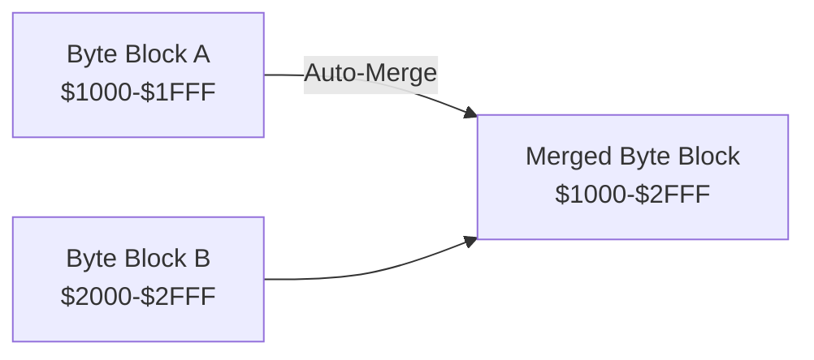
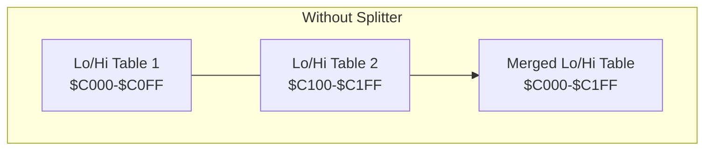
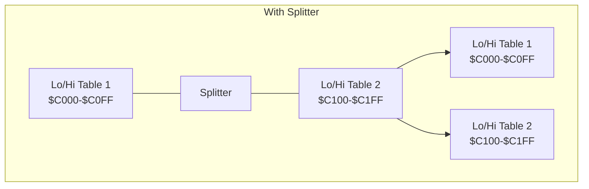

# Block Types and helpers

In Regenerator 2000, every byte of the loaded binary is assigned a **Block Type**. This type tells the disassembly
engine how to interpret that byte. You can change the Block Type for any region of memory using keyboard shortcuts
(in Visual Mode or for the single line under the cursor).

The available Block Types are:

## 1. Code

- **Shortcut**: ++c++
- **Description**: Interprets the bytes as MOS 6502/6510 instructions.
- **Use Case**: Use this for all executable machine code.

!!! example

    === "64tass"

        ```asm
        ; Code blocks are represented as code
        lda #$00
        sta aD020
        ```

    === "ACME"

        ```asm
        ; Code blocks are represented as code
        lda #$00
        sta aD020
        ```

    === "KickAssembler"

        ```asm
        // Code blocks are represented as code
        lda #$00
        sta aD020
        ```

    === "ca65"

        ```asm
        ; Code blocks are represented as code
        lda #$00
        sta aD020
        ```

## 2. Data Byte

- **Shortcut**: ++b++
- **Description**: Represents data as single 8-bit values.
- **Use Case**: sprite data, distinct variables, tables, memory regions where the data format is
  unknown, etc.

!!! example

    === "64tass"

        ```asm
        ; Byte blocks are represented as bytes
        .byte $80, $40, $a2, $ff
        ```

    === "ACME"

        ```asm
        ; Byte blocks are represented as bytes
        !byte $80, $40, $a2, $ff
        ```

    === "KickAssembler"

        ```asm
        // Byte blocks are represented as bytes
        .byte $80, $40, $a2, $ff
        ```

    === "ca65"

        ```asm
        ; Byte blocks are represented as bytes
        .byte $80, $40, $a2, $ff
        ```

## 3. Data Word

- **Shortcut**: ++w++
- **Description**: Represents data as 16-bit Little-Endian values.
- **Use Case**: Use for 16-bit counters, pointers (that shouldn't be analyzed as code references), or math constants.

!!! example

    === "64tass"

        ```asm
        ; Word blocks are represented as words
        .word $1234, $ffaa, $5678, $0000, $abcd
        ```

    === "ACME"

        ```asm
        ; Word blocks are represented as words
        !word $1234, $ffaa, $5678, $0000, $abcd
        ```

    === "KickAssembler"

        ```asm
        // Word blocks are represented as words
        .word $1234, $ffaa, $5678, $0000, $abcd
        ```

    === "ca65"

        ```asm
        ; Word blocks are represented as words
        .word $1234, $ffaa, $5678, $0000, $abcd
        ```

## 4. Address

- **Shortcut**: ++a++
- **Description**: Represents data as 16-bit addresses. Unlike "Data Word", this type explicitly tells the analyzer that
  the value points to a location in memory.
- **Use Case**: Essential for **Jump Tables**. When you mark a table as "Address", Regenerator 2000 will create
  Cross-References (X-Refs) to the target locations, allowing you to see where indirect jumps land.

!!! example

    === "64tass"

        ```asm
        ; Address blocks are represented as words, that generates an address reference
        .word a1234, aFFAA, a5678, a0000, aABCD
        ```

    === "ACME"

        ```asm
        ; Address blocks are represented as words, that generates an address reference
        !word a1234, aFFAA, a5678, a0000, aABCD
        ```

    === "KickAssembler"

        ```asm
        // Address blocks are represented as words, that generates an address reference
        .word a1234, aFFAA, a5678, a0000, aABCD
        ```

    === "ca65"

        ```asm
        ; Address blocks are represented as words, that generates an address reference
        .word a1234, aFFAA, a5678, a0000, aABCD
        ```

## 5. PETSCII Text

- **Shortcut**: ++p++
- **Description**: Interprets bytes as PETSCII text sequences.
- **Use Case**: Use for game messages, high score names, or print routines. The disassembler will try to group
  contiguous characters into a single string.

!!! example

    === "64tass"

        ```asm
        .encode "none"
        .text "hello world"
        ```

    === "ACME"

        ```asm
        !text "hello world"
        ```

    === "KickAssembler"

        ```asm
        .encoding "petscii_upper"
        .text "hello world"
        ```

    === "ca65"

        ```asm
        .byte "hello world"
        ```

## 6. Screencode Text

- **Shortcut**: ++s++
- **Description**: Interprets bytes as Commodore Screen Codes (Matrix codes) text.
- **Use Case**: Use for data that is directly copied to Screen RAM ($0400). These values differ from standard PETSCII
  (e.g., 'A' is 1, not 65).

!!! example

    === "64tass"

        ```asm
        .encode "screen"
        .text "hello world"
        ```

    === "ACME"

        ```asm
        !scr "hello world"
        ```

    === "KickAssembler"

        ```asm
        .encoding "screencode_mixed"
        .text "hello world"
        ```

    === "ca65"

        ```asm
        ; Requires .macpack cbm
        scrcode "hello world"
        ```

## 7. Lo/Hi Address Table

- **Shortcut**: ++less-than++
- **Description**: Marks the selected bytes as the **Low / High** address table. Must have an even number of bytes.
  The first half will be the lo addresses, the second half will be the hi addresses.
- **Use Case**: C64 games often split address tables into two arrays (one for Low bytes, one for High bytes).

!!! example

    === "64tass"

        ```asm
        ; Assume that you have these bytes:
        ; $00, $01, $02, $03, $c0, $d1, $e2, $f3
        ; They will be represented as:
        .byte <aC000, <aD101, <aE202, <aF303
        .byte >aC000, >aD101, >aE202, >aF303
        ```

    === "ACME"

        ```asm
        ; Assume that you have these bytes:
        ; $00, $01, $02, $03, $c0, $d1, $e2, $f3
        ; They will be represented as:
        !byte <aC000, <aD101, <aE202, <aF303
        !byte >aC000, >aD101, >aE202, >aF303
        ```

    === "KickAssembler"

        ```asm
        // Assume that you have these bytes:
        // $00, $01, $02, $03, $c0, $d1, $e2, $f3
        // They will be represented as:
        .byte <aC000, <aD101, <aE202, <aF303
        .byte >aC000, >aD101, >aE202, >aF303
        ```

    === "ca65"

        ```asm
        ; Assume that you have these bytes:
        ; $00, $01, $02, $03, $c0, $d1, $e2, $f3
        ; They will be represented as:
        .byte <aC000, <aD101, <aE202, <aF303
        .byte >aC000, >aD101, >aE202, >aF303
        ```

## 8. Hi/Lo Address Table

- **Shortcut**: ++greater-than++
- **Description**: Marks the selected bytes as the **High / Low** address table. Must have an even number of bytes.
  The first half will be the hi addresses, the second half will be the lo addresses.
- **Use Case**: C64 games often split address tables into two arrays (one for Low bytes, one for High bytes).

!!! example

    === "64tass"

        ```asm
        ; Assume that you have these bytes:
        ; $00, $01, $02, $03, $c0, $d1, $e2, $f3
        ; They will be represented as:
        .byte >a00C0, >a01D1, >a02E2, >a03F3
        .byte <a00C0, <a01D1, <a02E2, <a03F3
        ```

    === "ACME"

        ```asm
        ; Assume that you have these bytes:
        ; $00, $01, $02, $03, $c0, $d1, $e2, $f3
        ; They will be represented as:
        !byte >a00C0, >a01D1, >a02E2, >a03F3
        !byte <a00C0, <a01D1, <a02E2, <a03F3
        ```

    === "KickAssembler"

        ```asm
        // Assume that you have these bytes:
        // $00, $01, $02, $03, $c0, $d1, $e2, $f3
        // They will be represented as:
        .byte >a00C0, >a01D1, >a02E2, >a03F3
        .byte <a00C0, <a01D1, <a02E2, <a03F3
        ```

    === "ca65"

        ```asm
        ; Assume that you have these bytes:
        ; $00, $01, $02, $03, $c0, $d1, $e2, $f3
        ; They will be represented as:
        .byte >a00C0, >a01D1, >a02E2, >a03F3
        .byte <a00C0, <a01D1, <a02E2, <a03F3
        ```

## 9. Lo/Hi Word Table

- **Shortcut**: ++t++
- **Description**: Marks the selected bytes as the **Low / High** word table. Must have a size divisible by 4.
  The first half will be the lo words, the second half will be the hi words.
- **Use Case**: The C64 SID frequency table.

!!! example

    === "64tass"

        ```asm
        ; Assume that you have these bytes:
        ; $00, $01, $02, $03, $c0, $d1, $e2, $f3
        ; They will be represented as:
        .byte <$C000, <$D101, <$E202, <$F303
        .byte >$C000, >$D101, >$E202, >$F303
        ```

    === "ACME"

        ```asm
        ; Assume that you have these bytes:
        ; $00, $01, $02, $03, $c0, $d1, $e2, $f3
        ; They will be represented as:
        !byte <$C000, <$D101, <$E202, <$F303
        !byte >$C000, >$D101, >$E202, >$F303
        ```

    === "KickAssembler"

        ```asm
        // Assume that you have these bytes:
        // $00, $01, $02, $03, $c0, $d1, $e2, $f3
        // They will be represented as:
        .byte <$C000, <$D101, <$E202, <$F303
        .byte >$C000, >$D101, >$E202, >$F303
        ```

    === "ca65"

        ```asm
        ; Assume that you have these bytes:
        ; $00, $01, $02, $03, $c0, $d1, $e2, $f3
        ; They will be represented as:
        .byte <$C000, <$D101, <$E202, <$F303
        .byte >$C000, >$D101, >$E202, >$F303
        ```

## 10. Hi/Lo Word Table

- **Shortcut**: ++shift+t++
- **Description**: Marks the selected bytes as the **High / Low** word table. Must have a size divisible by 4.
  The first half will be the hi words, the second half will be the lo words.
- **Use Case**: The C64 SID frequency table.

!!! example

    === "64tass"

        ```asm
        ; Assume that you have these bytes:
        ; $00, $01, $02, $03, $c0, $d1, $e2, $f3
        ; They will be represented as:
        .byte >$00C0, >$01D1, >$02E2, >$03F3
        .byte <$00C0, <$01D1, <$02E2, <$03F3
        ```

    === "ACME"

        ```asm
        ; Assume that you have these bytes:
        ; $00, $01, $02, $03, $c0, $d1, $e2, $f3
        ; They will be represented as:
        !byte >$00C0, >$01D1, >$02E2, >$03F3
        !byte <$00C0, <$01D1, <$02E2, <$03F3
        ```

    === "KickAssembler"

        ```asm
        // Assume that you have these bytes:
        // $00, $01, $02, $03, $c0, $d1, $e2, $f3
        // They will be represented as:
        .byte >$00C0, >$01D1, >$02E2, >$03F3
        .byte <$00C0, <$01D1, <$02E2, <$03F3
        ```

    === "ca65"

        ```asm
        ; Assume that you have these bytes:
        ; $00, $01, $02, $03, $c0, $d1, $e2, $f3
        ; They will be represented as:
        .byte >$00C0, >$01D1, >$02E2, >$03F3
        .byte <$00C0, <$01D1, <$02E2, <$03F3
        ```

## 11. External File

- **Shortcut**: ++e++
- **Description**: Treats the selected region as external binary data.
- **Use Case**: Use for large chunks of included binary data (like music SID files, raw bitmaps, or character sets) that
  you don't want to clutter the main source file. These will be exported as `.binary "filename.bin"` includes.

!!! example

    === "64tass"

        ```asm
        ; Assume that you have these bytes at address $1000
        ; $00, $01, $02, $03, $c0, $d1, $e2, $f3
        ; A binary file called "export-$1000-$1007.bin" will be generated
        ; And this code will be generated
        .binary "export-$1000-$1007.bin"
        ```

    === "ACME"

        ```asm
        ; Assume that you have these bytes at address $1000
        ; $00, $01, $02, $03, $c0, $d1, $e2, $f3
        ; A binary file called "export-$1000-$1007.bin" will be generated
        ; And this code will be generated
        !binary "export-$1000-$1007.bin"
        ```

    === "KickAssembler"

        ```asm
        // Assume that you have these bytes at address $1000
        // $00, $01, $02, $03, $c0, $d1, $e2, $f3
        // A binary file called "export-$1000-$1007.bin" will be generated
        // And this code will be generated
        .import binary "export-$1000-$1007.bin"
        ```

    === "ca65"

        ```asm
        ; Assume that you have these bytes at address $1000
        ; $00, $01, $02, $03, $c0, $d1, $e2, $f3
        ; A binary file called "export-$1000-$1007.bin" will be generated
        ; And this code will be generated
        .incbin "export-$1000-$1007.bin"
        ```

## 12. Undefined

- **Shortcut**: ++question-mark++
- **Description**: Resets the block to an "Unknown" state.
- **Use Case**: Use this if you made a mistake and want the Auto-Analyzer to take a fresh look at the usage of this
  region.

!!! example

    === "64tass"

        ```asm
        ; Undefined blocks are represented as single bytes, one byte per line.
        .byte $00
        .byte $ca
        .byte $ff
        ```

    === "ACME"

        ```asm
        ; Undefined blocks are represented as single bytes, one byte per line.
        !byte $00
        !byte $ca
        !byte $ff
        ```

    === "KickAssembler"

        ```asm
        // Undefined blocks are represented as single bytes, one byte per line.
        .byte $00
        .byte $ca
        .byte $ff
        ```

    === "ca65"

        ```asm
        ; Undefined blocks are represented as single bytes, one byte per line.
        .byte $00
        .byte $ca
        .byte $ff
        ```

## 13. Helpers for Immediate Mode instructions

### Cycle Data Types for immediate mode instructions

- **Shortcut**: ++d++ / ++shift+d++
- **Description**: Cycles the current immediate mode instruction through the available representations (Hex, Decimal, Binary):
    - **++d++**: Cycles forward.
    - **++shift+d++**: Cycles backward.
- **Use Case**: Sometimes a decimal, or binary representation makes more sense than an hexadecimal one.

| Representation    | Name                |
| :---------------- | :------------------ |
| `lda #$d2`        | Hexadecimal         |
| `lda #~$2d`       | Inverse Hexadecimal |
| `lda #210`        | Decimal             |
| `lda #-46`        | Inverse Decimal     |
| `lda #%11010010`  | Binary              |
| `lda #~%00101101` | Inverse Binary      |

### Convert LDA/LDX/LDY vector instructions to lo/hi, or hi/lo addresses

- **Shortcut**: ++bracket-left++ / ++bracket-right++
- **Description**: Quickly assigns a "lo/hi" or "hi/lo" address to the selection.
    - **++bracket-left++**: For **Lo/Hi Address**.
    - **++bracket-right++**: For **Hi/Lo Address**.
- **Use Case**: When manually setting 16-bit pointers. See exmaple.

Example:

It is clear that `$0314` / `$0315` contains a vector.
Select the first 3 lines in the Dissasembly view, and press ++open-bracket++.

```asm hl_lines="1-3"
    lda #$80        ; $80 is the low part of $1480
    sta $0314
    lda #$14        ; $14 is the high part of $1480
    sta $0315

; IRQ handler in address $1480
    rti
```

And it will be converted to a "lo/hi" address, and it will look like:

```asm
    ; And the LDA #immediate_mode will be converted to an lo/hi address
    lda #<p1480
    sta $0314
    lda #>p1480
    sta $0315

; IRQ handler in address $1480
p1480
    rti
```

You can also revert the change by pressing:

* ++u++ to undo
* or press ++d++ to remove the hi/lo or lo/hi address, and represent it as hexadecimal again.

## Organization Tools

Beyond data types, you can organize your view using Comments, Splitters, and Collapsing:

### Comments

- **Side Comment**: ++semicolon++
- **Line Comment**: ++colon++

You can add comments to any line to annotate your disassembly.

- **Side Comments**: Displayed on the same line as the instruction or data, to the right.
- **Line Comments**: Displayed on a separate line above the instruction or data.

!!! note
    **Line Comments** also function as **Splitters**. Inserting a line comment into a grouped block (like a sequence of bytes) will split the block at that point, preventing the auto-merger from combining them.

### Splitters and Auto-Merging
 
- **Shortcut**: ++pipe++
 
In Regenerator 2000, adjacent blocks of the same type are **automatically merged** into a single contiguous block. This feature keeps the disassembly clean (e.g., combining adjacent Byte blocks into single Byte block).

!!! note

    Only **adjacent** blocks of the **same type** are auto-merged.


 
**Splitters** (and **Line Comments**) are used to prevent this behavior when needed. They serve two purposes:
 
1.  **Visual Separation**: Inserts a visual separator (newline) in the disassembly view.
2.  **Logical Separation**: Acts as a barrier that **stops the auto-merger**.
 
**Example**:
Imagine you have a Lo/Hi table right after another. Without a splitter, they become one. With a splitter, they remain separate.
 




!!! important
    Splitters are especially critical for **Lo/Hi** and **Hi/Lo Address/Word Table** blocks. Because these blocks calculate the split point between the Low and High parts based on the total length of the block, merging two independent tables would result in an incorrect calculation of addresses.

### Collapsing Blocks

- **Collapse/Uncollapse**: ++ctrl+k++
- **Description**: Hides or shows the content of a block, showing only a summary line.

!!! example

    Valid for the **Disassembly view**.

    **Expanded View:**
    ```asm
    a1000   .byte $01, $02, $03, $04, $05, $06, $07, $08
            .byte $09, $0a, $0b, $0c, $0d, $0e, $0f, $10
    ```

    **Collapsed View:**
    ```asm
    a1000  ; Collapsed Byte block from $1000-$100F
    ```

!!! example

    Valid for the **Block view**: collapsed blocks are tagged with a ++plus++.

    ```text
      $0900-$09FF [Code]
    + $1000-$100F [Byte]
      $1010-$11FF [Code]
    ```

- **Use Case**: Use this to hide large tables, long text strings, or finished subroutines to keep your workspace clean and focus on the code you are currently analyzing.
- **Scope**: This is a **visual-only** feature for the Disassembly View. It does **not** affect:
    -   The exported assembly code (all code is always exported).
    -   Other views (e.g., Hex Dump, Character Set).
