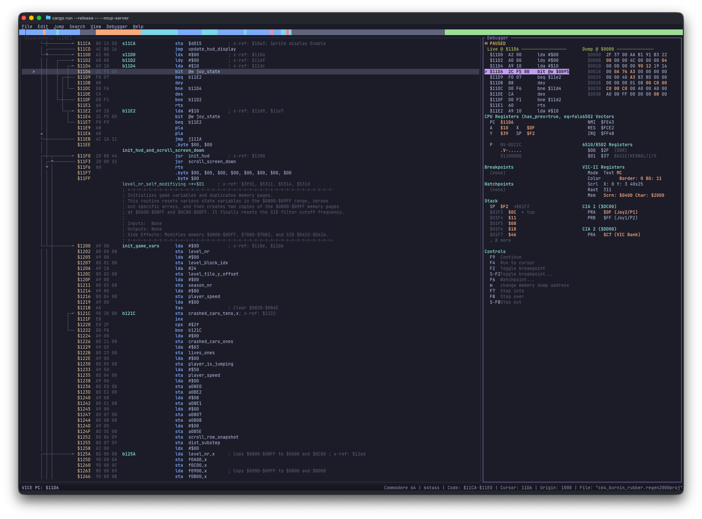
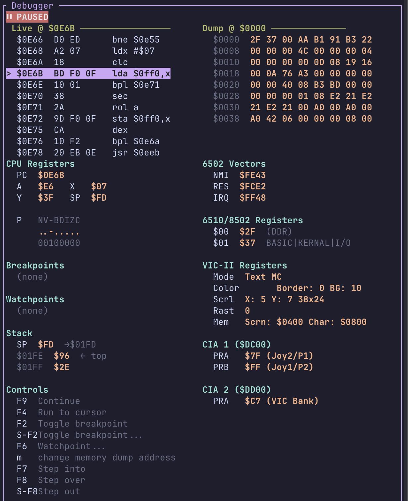

# Debugger (VICE Integration)

Regenerator 2000 can connect to the [VICE](https://vice-emu.sourceforge.io/) emulator to provide live debugging:
view the current program counter (PC), registers and disassembly, while the program runs, and use breakpoints,
step, and run-to-cursor directly from the TUI.

## Connecting to VICE

1. Start VICE with the **remote monitor** enabled so it listens for a TCP connection. For example, for C64:
   `x64 -binarymonitor`
2. In Regenerator 2000, open the **Debugger** menu and choose **Connect to VICE...**.
3. The dialog defaults to `localhost:6502`. Press **Enter** to connect.
4. To show the Debugger panel in the right pane, use **View → Toggle Debugger View** (or ++alt+6++ / ++ctrl+6++).
   You can also switch to the Debugger pane with **Tab** when it is visible.

Once connected, the Debugger panel shows connection status and, when the emulator is stopped, live disassembly around the PC, registers, and breakpoints.

## What the Debugger Panel Shows

- **Connection status**: Whether Regenerator 2000 is connected to VICE and whether the emulator is running or stopped.
- **Live disassembly**: When stopped, a small window of disassembly around the current PC, with the current instruction highlighted.
- **Registers**: A, X, Y, SP, and P (status) when available.
- **Breakpoints**: List of breakpoints set in VICE.
- **Watchpoints**: List of watchpoins set in VICE.

The main **Disassembly** view also reflects the debugger when connected: the current PC is highlighted, and breakpoints are indicated. You can set or clear a breakpoint at the cursor with **F2**. And do the same with watchpoints with **F6**.

## Keyboard Shortcuts

All debugger actions are available from the **Debugger** menu and have keyboard shortcuts. For the full list, see [Keyboard Shortcuts](keyboard_shortcuts.md). Summary:

| Action            | Shortcut     |
| ----------------- | ------------ |
| Toggle Breakpoint | ++f2++       |
| Run to Cursor     | ++f4++       |
| Watchpoint        | ++f6++       |
| Step Instruction  | ++f7++       |
| Step Over         | ++f8++       |
| Step Out          | ++shift+f8++ |
| Run / Continue    | ++f9++       |

Disconnect using **Debugger → Disconnect from VICE**.
