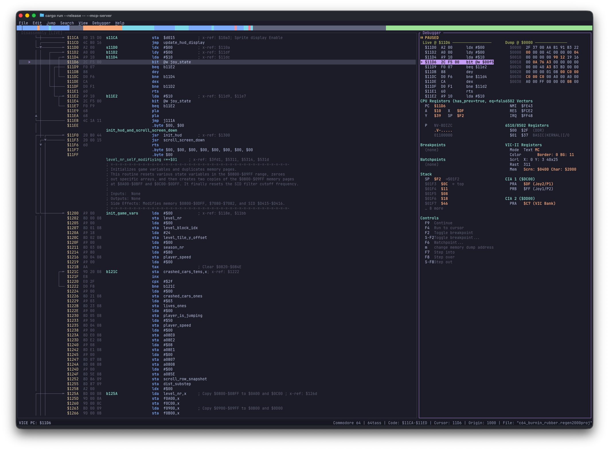
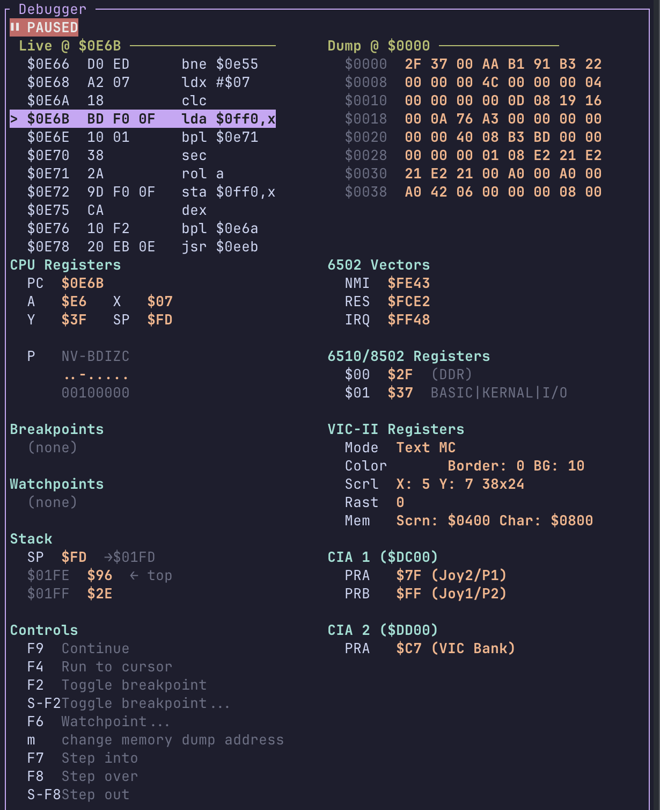

# Debugger (VICE Integration)

Regenerator 2000 can connect to the [VICE](https://vice-emu.sourceforge.io/) emulator to provide live debugging:
view the current program counter (PC), registers and disassembly, while the program runs, and use breakpoints,
step, and run-to-cursor directly from the TUI.

## Connecting to VICE

!!! note

    Both VICE and Regenerator 2000 must be running the same binary. E.g:
    ```bash
    # Start VICE
    x64 -binarymonitor my_program.prg

    # Start Regenerator 2000
    regenerator2000 my_program.prg
    ```

1. Start VICE with the **remote monitor** enabled so it listens for a TCP connection. For example, for C64:
   `x64 -binarymonitor`
2. In Regenerator 2000, open the **Debugger** menu and choose **Connect to VICE...**.
3. The dialog defaults to `localhost:6502`. Press **Enter** to connect.
4. To show the Debugger panel in the right pane, use **View → Toggle Debugger View** (or ++alt+6++ / ++ctrl+6++).
   You can also switch to the Debugger pane with **Tab** when it is visible.

### Auto-connecting via CLI

You can skip the manual connect step by passing `--vice <HOST:PORT>` on the command line. Regenerator 2000 will
attempt to connect to VICE automatically at startup:

```bash
# Start VICE
x64 -binarymonitor my_program.prg

# Start Regenerator 2000 and auto-connect
regenerator2000 --vice localhost:6502 my_program.prg
```

The default VICE binary monitor port is **6502**. If you changed it with `-binarymonitoraddress`, pass the
matching address to `--vice`.

Once connected, the Debugger panel shows connection status and, when the emulator is stopped, live disassembly around the PC, registers, and breakpoints.



## What the Debugger Panel Shows

- **Connection status**: Whether Regenerator 2000 is connected to VICE and whether the emulator is running or stopped. When paused, the specific stop reason (e.g., which watchpoint was hit) is displayed next to the "PAUSED" status indicator.
- **Live disassembly**: When stopped, a small window of disassembly around the current PC, with the current instruction highlighted.
- **Registers**: CPU registers (A, X, Y, SP, and P) are shown.
- **Hardware Registers**: Platform-specific registers are displayed to monitor hardware state:
    - **C64/C128**: VIC-II registers, CIA 1 & 2 registers, and the 6510/8502 I/O port ($00/$01).
    - **VIC-20**: VIC-I registers ($9000–$900F).
    - **Plus/4**: TED chip registers ($FF00–$FF3F).
    - **All platforms**: 6502 Hardware Vectors (NMI at $FFFA, RESET at $FFFC, IRQ at $FFFE).
- **Change Highlighting**: Changed register values, memory bytes, and hardware vectors are highlighted in a distinct color after each execution step to quickly identify what changed.
- **Breakpoints**: List of breakpoints set in VICE.
- **Watchpoints**: List of watchpoints set in VICE.

!!! note

    The debugger panel uses a multi-column layout on wider terminals to show more information at once (e.g., Stack and Hardware Registers side-by-side). Screenshots below might show an older single-column layout.




The main **Disassembly** view also reflects the debugger when connected: the current PC is highlighted, and breakpoints are indicated.
You can toggle a breakpoint at the cursor with ++f2++, or toggle a breakpoint at any address with ++shift+f2++.
And do the same with watchpoints with ++f6++.

## Memory Dump

When connected and paused, the Debugger panel can show a **Memory Dump** alongside the live disassembly.
Press ++m++ (while the Debugger pane is focused) to open the **Memory Dump Address** dialog and enter
a memory address (e.g., `0400` for Screen RAM, or `D000` for VIC-II registers).

The dump displays 64 bytes (8 rows × 8 bytes) starting from the specified address, refreshing
automatically every time the emulator stops (e.g., after a step or breakpoint hit).

If no memory dump address has been set, the panel shows `(press 'm' to config)`.

## Stack

The Debugger panel also displays the **Stack** contents when connected and paused. It shows the
current stack pointer value and up to 5 entries from the top of the stack.

## Keyboard Shortcuts

All debugger actions are available from the **Debugger** menu and have keyboard shortcuts. For the full list, see [Keyboard Shortcuts](keyboard_shortcuts.md). Summary:

| Action               | Shortcut     |
| -------------------- | ------------ |
| Toggle Breakpoint    | ++f2++       |
| Toggle Breakpoint... | ++shift+f2++ |
| Run to Cursor        | ++f4++       |
| Watchpoint           | ++f6++       |
| Memory Dump...       | ++m++        |
| Step Into            | ++f7++       |
| Step Over            | ++f8++       |
| Step Out             | ++shift+f8++ |
| Run / Continue       | ++f9++       |

Disconnect using **Debugger → Disconnect from VICE**.
