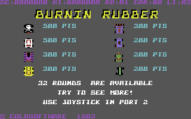
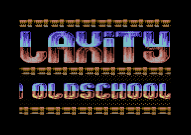
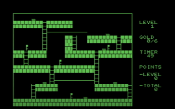

# Disassembly Examples

Welcome to the Regenerator 2000 examples documentation. These HTML disassemblies are generated directly by Regenerator 2000 and showcase the auto-analysis, layout parity, and modern styling capabilities of our HTML exporter.

Below are the main examples available in this project:

## Burnin' Rubber - Commodore 64

A disassembly of the Commodore 64 ["Burnin' Rubber"][burnin_rubber_info] game.

- Disassembly: [c64_burnin_rubber.html](examples/c64_burnin_rubber.html)

Main take aways:

- The code was written in a [monitor][monitor], not with an assembler. Evidence:
  - The game contains dead code
  - There is a `.T0400,07FF,2C00` monitor command [in the code][c64_burning_rubber_monitor_cmd]
  - There are `JMP` opcodes in different places that are typical of monitor-based code
- The code is not "clean", not a good place to start looking to code C64 video games.
  - but the code is great to understand how monitor-based C64 games were made.

Source:

- Link: [Burnin' Rubber.tap][burnin_rubber_tap]
- The game was taken from the original TAP source.
- The game was encrypted. Part of the game code was in the loader, and part was in the main program.
- The diassembly contains a single file that includes the decrypted main program with part of the loader code.
- Part of the encrypted code is still present, but not used.
- Run it with with: `SYS 4752`

[burnin_rubber_tap]: https://archive.org/download/Ultimate_Tape_Archive_V5/Ultimate_Tape_Archive_V5.zip/Ultimate_Tape_Archive_V5.0%2FBurnin%27_Rubber_%281983_Audiogenic_Ltd.%29_%5B5346%5D%2FBurnin%27_Rubber.tap
[burnin_rubber_info]: https://www.c64-wiki.com/wiki/Burnin_Rubber>
[monitor]: https://www.c64-wiki.com/wiki/MONITOR
[c64_burning_rubber_monitor_cmd]: examples/c64_burnin_rubber.html#L2BE0

---

## Moving Tubes - Commodore 64

A disassembly of [Moving Tubes][moving_tubes] intro, by Laxity.

- Disassembly: [c64_moving_tubes_lxt.html](examples/c64_moving_tubes_lxt.html)

Main take aways:

- Clean code.
- Great place to learn how a SID player works, since the SID player was disassembled in detail.
- Great place if you want to learn about how to handle multiple IRQ interrupts in your C64 game.

Source:

- Link: [Moving Tubes (Laxity Intro #145)][moving_tubes]
- The intro was packed. The disassembly contains the unpacked version of the intro. It was unpacked using [Unp64][unp64].

[moving_tubes]: https://csdb.dk/release/?id=259330
[unp64]: https://csdb.dk/release/?id=260619

---

## Lode Runner - Commodore PET

A disassembly of [Lode Runner][lode_runner_site] clone for Commodore PET, by jimbo.

- Disassembly: [pet_loderunner.html](examples/pet_loderunner.html)

Main take aways:

- Clean code.
- Great place to learn about the PET programming.

Source:

- Link: [Lode Runner for the PET by jimbo][lode_runner_site]
- Since the game was not packed, this is a good example of how the disassembly looks like without any post-processing.

[lode_runner_site]: https://jimbo.itch.io/lode-runner-clone-for-commodore-pet

---
