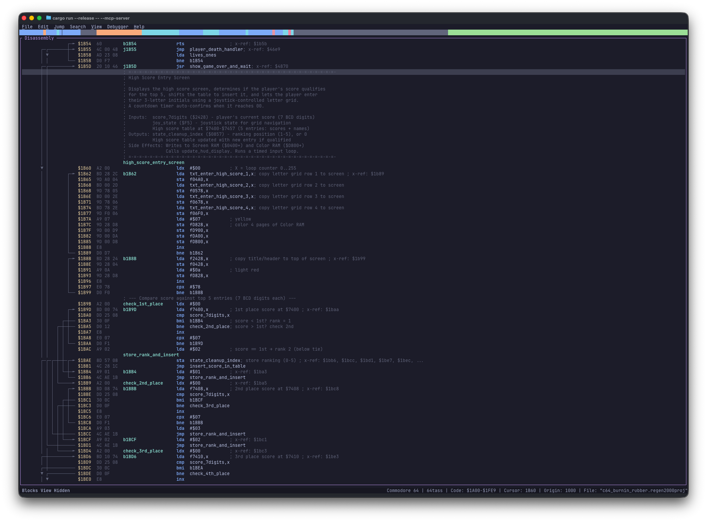
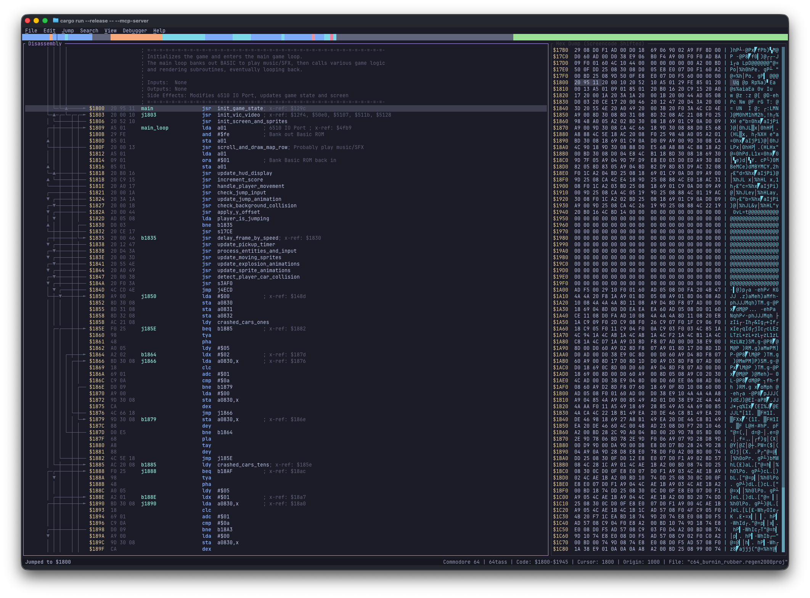
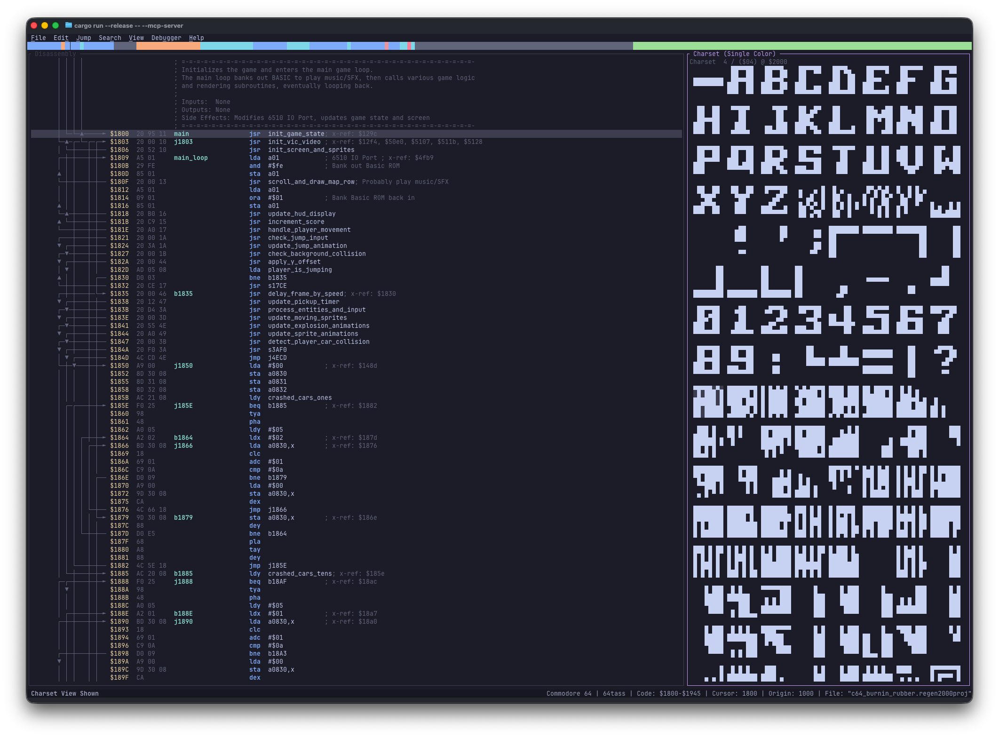
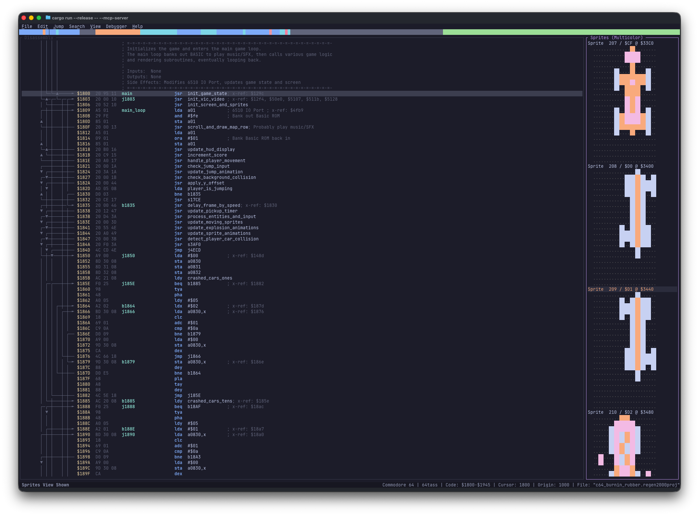
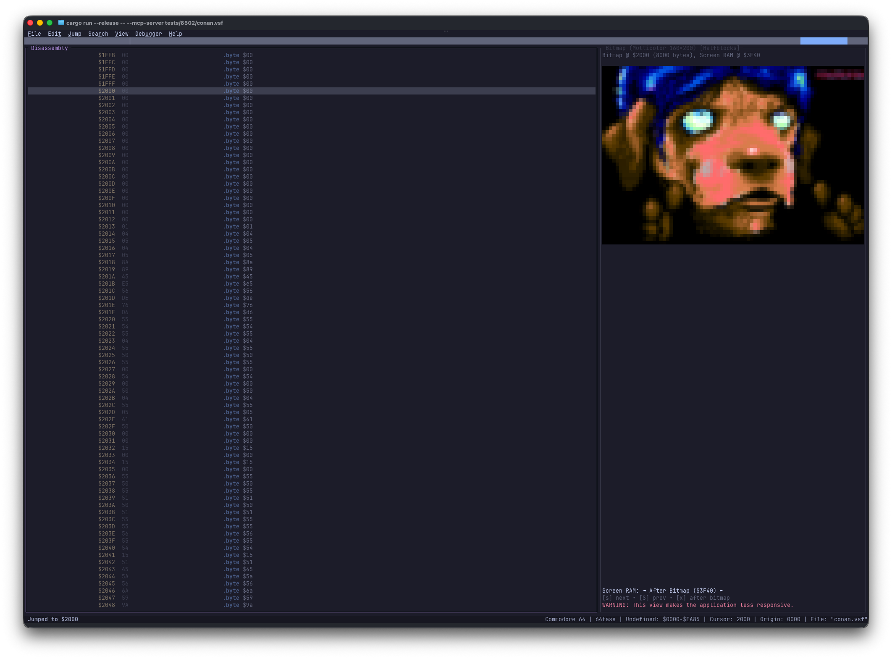
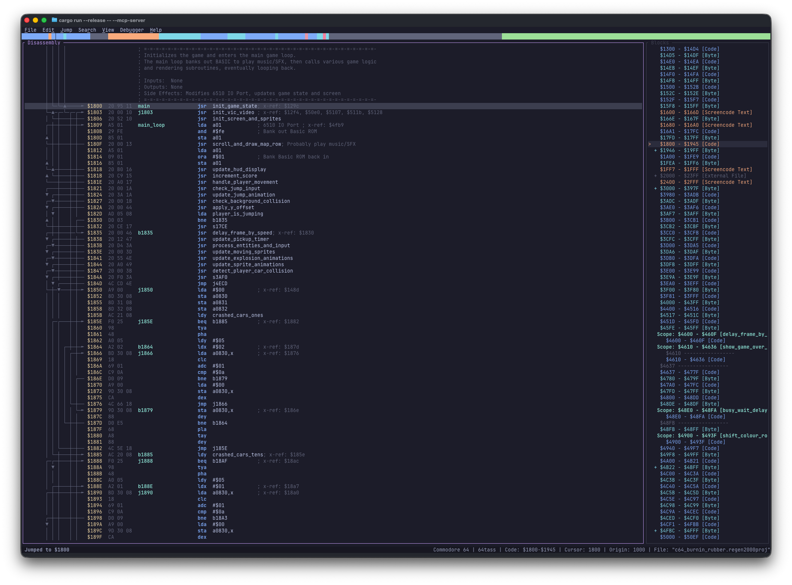
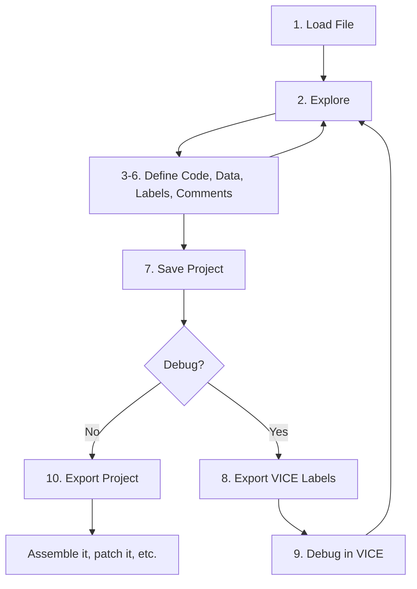

# Regenerator 2000

<p align="center">
  
</p>

# The Modern 6502 Disassembler

**Regenerator 2000** is a modern, interactive disassembler for the Commodore 64 and other 6502-based systems. It combines the retro feel of Turbo Debugger with the power of modern tools like IDA Pro, all within a fast, keyboard-centric terminal interface.

---

## At a Glance

Explore the regenerative power of Regenerator 2000 through its various views:

=== "Disassembly"

    **The Code View**: The heart of the operation. Navigate code, follow jumps, and label everything.

    

=== "Hexdump"

    **The Data View**: Inspect raw memory, spotting patterns in data and tables.

    

=== "Character Set"

    **Visualizing Graphics**: Instantly see 8x8 character data.

    

=== "Sprites"

    **Sprite Gallery**: View 24x21 sprites in all their glory.

    

=== "Bitmap"

    **Bitmap Mode**: Visualize memory as a bitmap (HiRes or MultiColor).

    

=== "Blocks"

    **Structure Analysis**: See how Regenerator 2000 analyzes and segments the binary into code and data blocks.

    

=== "Debugger"

    **Live Debugging**: Connect to VICE, view registers, memory, breakpoints, and step through code.

    

---

## Key Features

- **🚀 6502 & Undocumented Opcodes**: Full support for the 6502 instruction set.
- **⚡ Fast TUI**: Built with Rust for blazingly fast performance.
- **🧠 Analysis**: Automatically create labels and comments.
- **⏪ Undo/Redo**: Experiment without fear.
- **🏷️ Labels & Comments**: Rename subroutines and variable for readability.
- **🐛 VICE Debugger Integration**: Connect to a running VICE emulator for live debugging — step through code, inspect registers, set breakpoints and watchpoints.
- **🤖 MCP Integration**: Collaborate with AI assistants for deeper analysis.
- **💾 Project Saving**: Save your work and resume later.
- **📤 Export**: Generate compilable source code or VICE labels for debugging.

## Quick Start

1.  **Install**:

    ```bash
    cargo install regenerator2000
    ```

2.  **Run**:

    ```bash
    regenerator2000 my_game.prg
    ```

3.  **Explore**:
    - **Move**: Arrow keys, map, or jumps.
    - **Define Code**: Press ++c++
    - **Define Data**: Press ++b++
    - **Comment**: Press ++semicolon++
    - **Rename**: Press ++l++

[Get Started Now](install.md){ .md-button .md-button--primary }

---

## Documentation

- **[Installation & Usage](install.md)**: Setup guide.
- **[Views](views.md)**: Detailed breakdown of each view.
- **[Keyboard Shortcuts](keyboard_shortcuts.md)**: Master the controls.
- **[Debugger (VICE)](debugger.md)**: Connect to VICE for live debugging.
- **[MCP Integration](mcp.md)**: meaningful AI collaboration.

## Tutorial

A typical workflow involves loading a file, identifying code and data regions, labeling them, and iteratively refining the disassembly.



For a detailed step-by-step walkthrough, check out the [full tutorial](tutorial.md).
