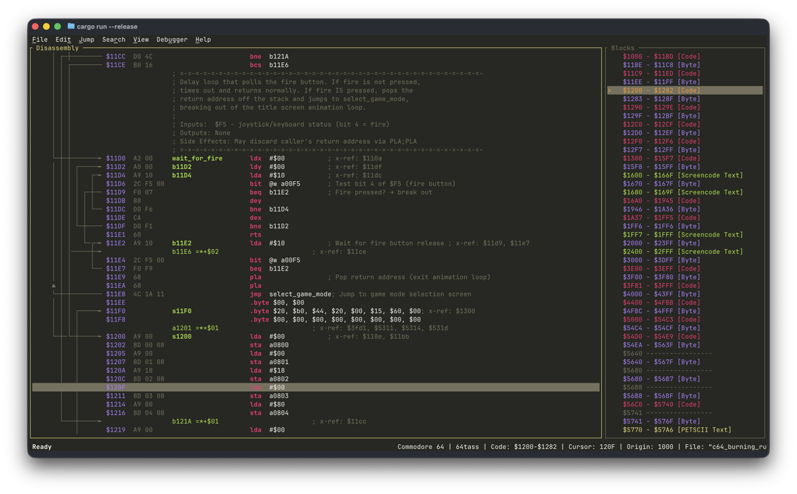
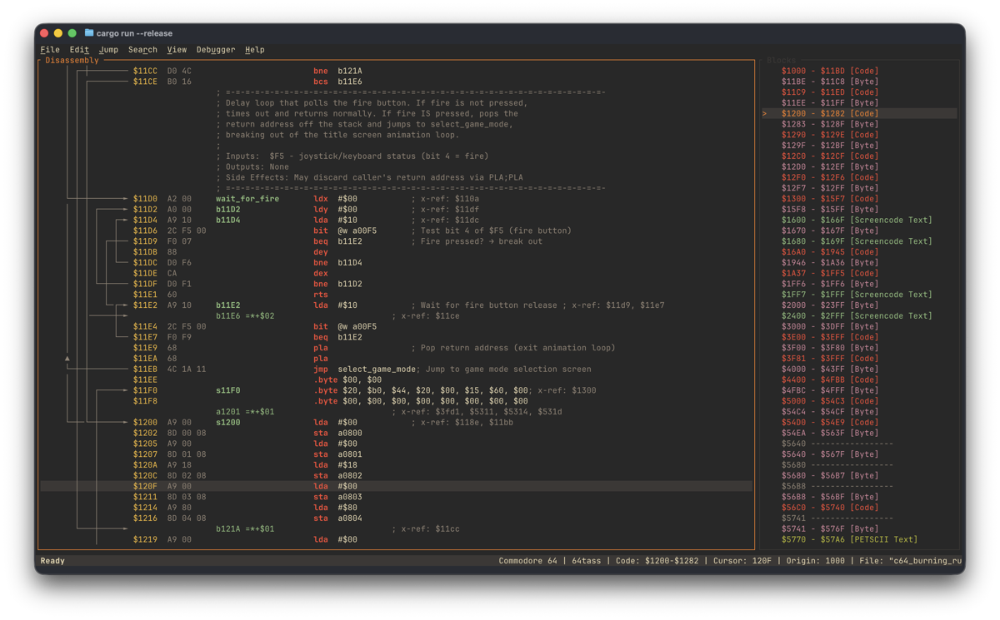
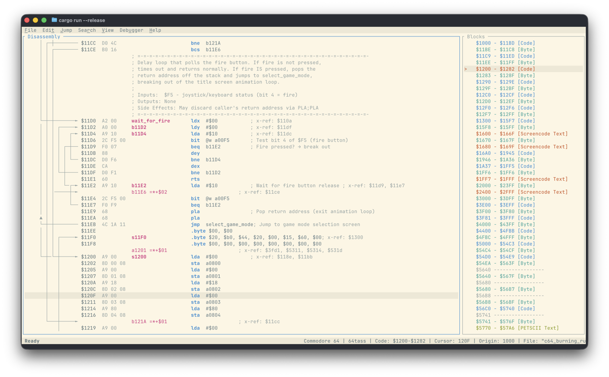
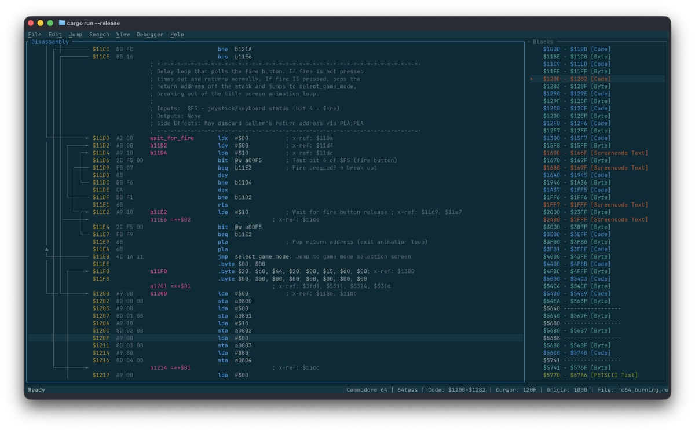
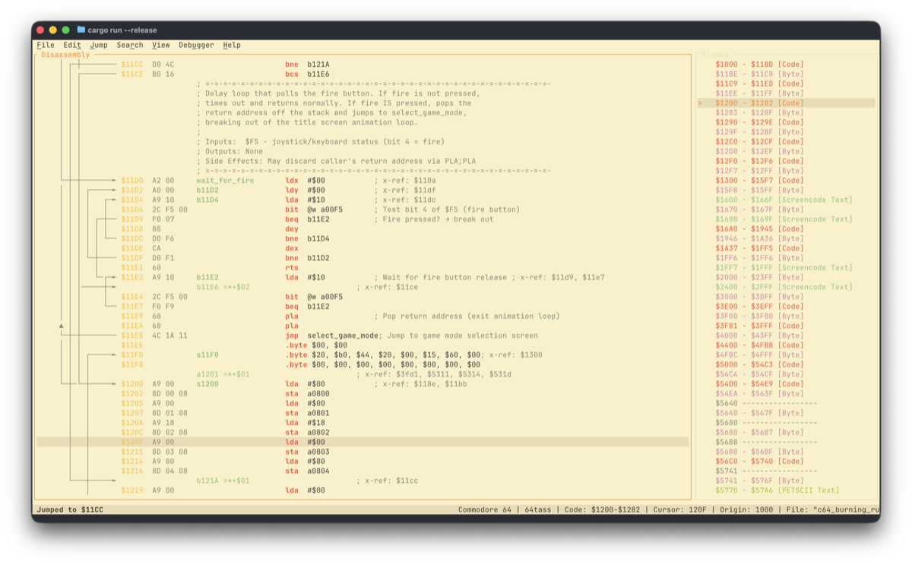
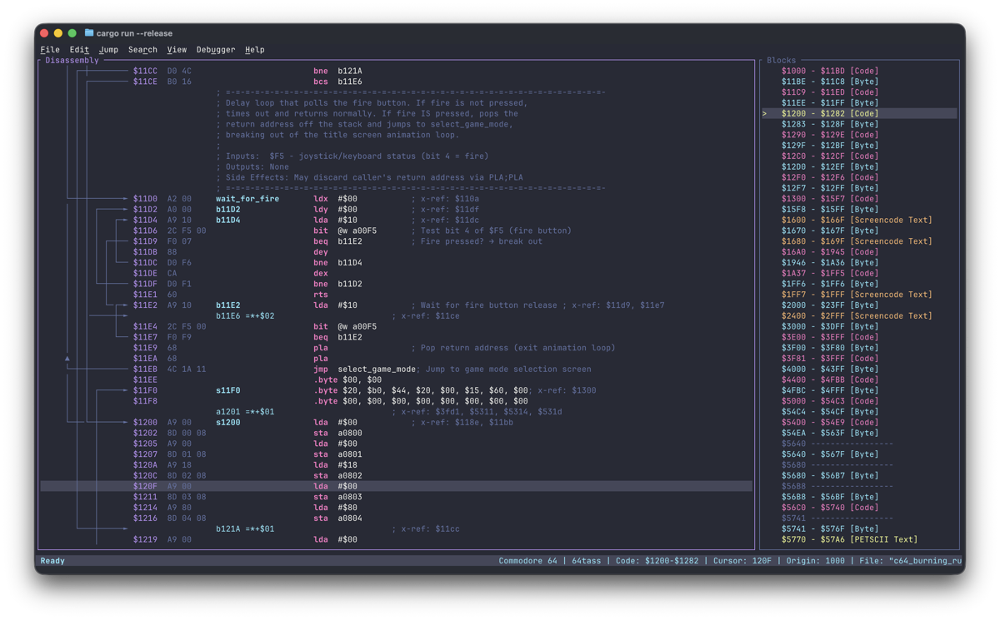
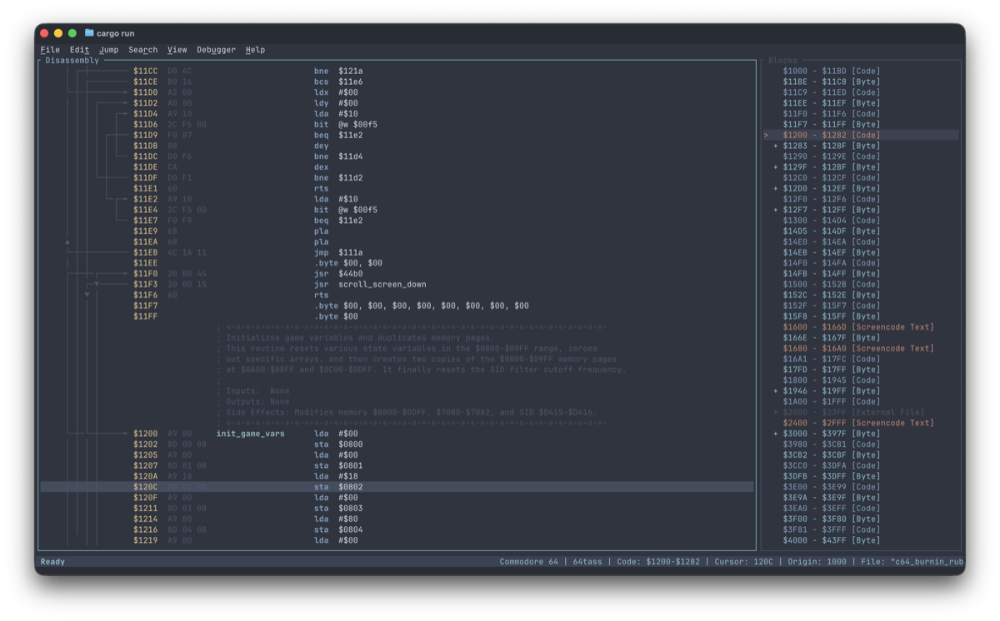
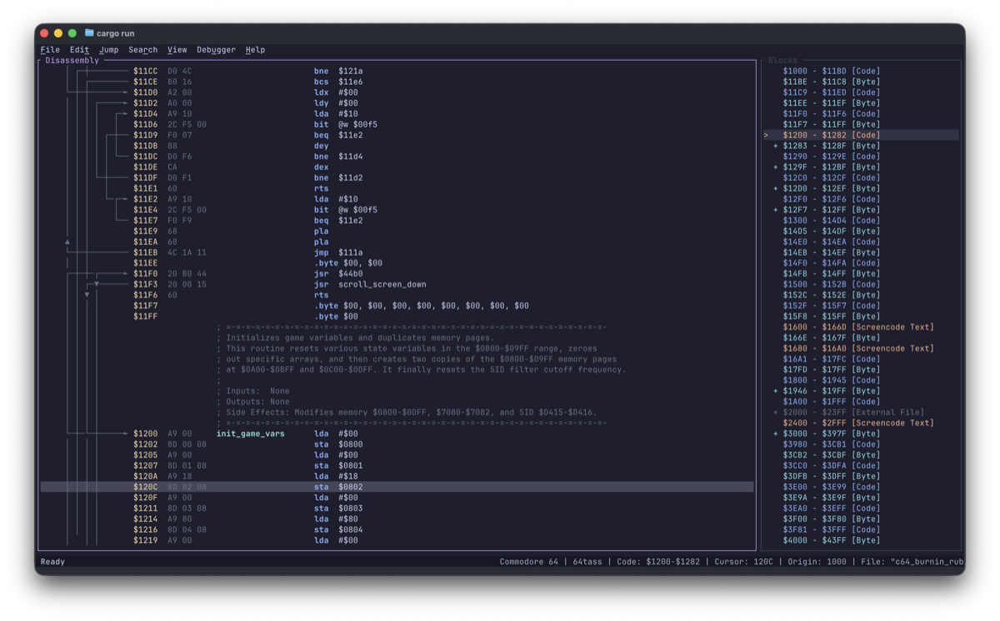
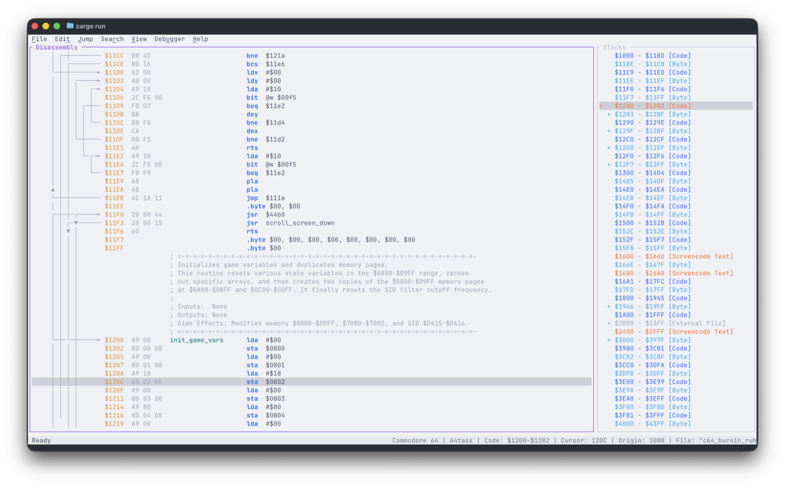

# Themes

Regenerator 2000 ships with **9 built-in color themes**. You can switch between them in **File → Settings**
(++alt+p++ or ++ctrl+comma++) under the **Theme** option.

## Available Themes

=== "Dracula"

    **The default theme.** A dark theme with vibrant accent colors (purple, pink, cyan). Popular across many editors.

    

=== "Solarized Dark"

    A popular low-contrast dark palette by Ethan Schoonover. Easy on the eyes for long sessions.

    

=== "Solarized Light"

    The light variant of Solarized. Good for bright environments or high-ambient-light setups.

    

=== "Gruvbox Dark"

    A retro-groove color scheme with warm, earthy tones (orange, yellow, aqua).

    

=== "Gruvbox Light"

    The light variant of Gruvbox. A warm, creamy background with the same earthy accent colors. Great for bright environments.

    

=== "Monokai"

    A classic dark theme with bold, saturated accent colors. Originally from Sublime Text.

    

=== "Nord"

    An arctic, north-bluish color palette. Low contrast with a cool, muted aesthetic inspired by the polar night.

    

=== "Catppuccin Mocha"

    The darkest flavor of Catppuccin — a soothing pastel theme with warm tones on a deep background.

    

=== "Catppuccin Latte"

    The light flavor of Catppuccin — pastel colors on a warm, creamy background. Great for daytime use.

    

## How to Change the Theme

1. Open **File → Settings** (++alt+p++ or ++ctrl+comma++).
2. Navigate to the **Theme** option.
3. You can change the theme in two ways:
    - Press ++left++ / ++right++ to cycle through themes instantly (live preview).
    - Press ++enter++ to open the theme selector popup and pick from the full list.
4. Choose a theme and press ++enter++.

The theme is saved globally and persists across sessions and projects.

!!! tip

    All themes support true color (24-bit RGB). For the best visual experience, use a terminal with true color
    support. See the [Recommended Terminals](install.md#recommended-terminals) section.

## Custom Themes

You can create your own themes or override any built-in theme by placing a `theme-*.toml` file in the
application config directory.

### Config directory location

| Platform    | Config directory                                              |
| :---------- | :------------------------------------------------------------ |
| **macOS**   | `~/Library/Application Support/regenerator2000/`             |
| **Linux**   | `~/.config/regenerator2000/`                                  |
| **Windows** | `C:\Users\<User>\AppData\Roaming\regenerator2000\config\`     |

### Getting started

The easiest way to create a custom theme is to start from the built-in files:

1. **Dump** all built-in themes to the config directory:

    ```bash
    # macOS
    regenerator2000 --dump-theme-files ~/Library/Application\ Support/regenerator2000/

    # Linux
    regenerator2000 --dump-theme-files ~/.config/regenerator2000/

    # Windows (PowerShell)
    regenerator2000.exe --dump-theme-files $env:APPDATA\regenerator2000\config\
    ```

    This writes every `theme-*.toml` to the destination folder and exits.

2. **Edit** an existing file or create a new one (e.g. `theme-green_screen.toml`):

    ```toml
    name = "Green Screen"
    base = "Solarized Dark"
    background = "#001100"
    foreground = "#33FF33"
    border_active = "#33FF33"
    border_inactive = "#116611"
    ```

3. **Launch** Regenerator 2000 — your custom theme appears in **Settings → Theme**.

### How it works

- Theme files must be named `theme-<name>.toml` (e.g. `theme-green_screen.toml`).
- The `name` field is the display name shown in the theme selector.
- The optional `base` field names a built-in theme to inherit from. Any color field you omit is
  filled in from the base (defaults to `"Solarized Dark"` when not specified).
- A custom theme with the **same name** as a built-in theme **replaces** the built-in.
- Colors use hex format: `"#RRGGBB"`.

!!! tip

    **Partial themes** are the recommended approach — only override the colors you care about and
    inherit the rest from a base theme. This makes your theme file short and easy to maintain.

### TOML schema reference

Every `theme-*.toml` file has the following top-level keys:

| Field | Type | Description |
| :--- | :--- | :--- |
| `name` | string | **Required.** Display name shown in the theme selector. Must be unique. |
| `base` | string | Optional. Name of a built-in theme to inherit from. Defaults to `"Solarized Dark"`. |
| _color fields_ | string | Optional. Hex color (`"#RRGGBB"`). See below for the full list. |
| `hex_color_palette` | array of strings | Optional. 18-entry array of hex colors for the Hex Dump palette. |

### Color fields

All color fields accept hex strings in `#RRGGBB` format. Omitted fields inherit from the base theme.

**Base colors:** `background`, `foreground`, `border_active`, `border_inactive`, `selection_bg`,
`selection_fg`, `block_selection_bg`, `block_selection_fg`, `status_bar_bg`, `status_bar_fg`

**Code / Disassembly:** `address`, `bytes`, `mnemonic`, `operand`, `label`, `label_def`, `comment`,
`arrow`, `collapsed_block`, `collapsed_block_bg`

**Hex View:** `hex_bytes`, `hex_ascii`

**UI Elements:** `dialog_bg`, `dialog_fg`, `dialog_border`, `menu_bg`, `menu_fg`, `menu_selected_bg`,
`menu_selected_fg`, `menu_disabled_fg`, `sprite_multicolor_1`, `sprite_multicolor_2`,
`charset_multicolor_1`, `charset_multicolor_2`

**Highlights:** `highlight_fg`, `highlight_bg`, `error_fg`

**Block Types (fg/bg):** `block_code_fg`, `block_code_bg`, `block_scope_fg`, `block_scope_bg`,
`block_data_byte_fg`, `block_data_byte_bg`, `block_data_word_fg`, `block_data_word_bg`,
`block_address_fg`, `block_address_bg`, `block_petscii_text_fg`, `block_petscii_text_bg`,
`block_screencode_text_fg`, `block_screencode_text_bg`, `block_lohi_fg`, `block_lohi_bg`,
`block_hilo_fg`, `block_hilo_bg`, `block_external_file_fg`, `block_external_file_bg`,
`block_undefined_fg`, `block_undefined_bg`, `block_splitter_fg`, `block_splitter_bg`,
`minimap_cursor_fg`
