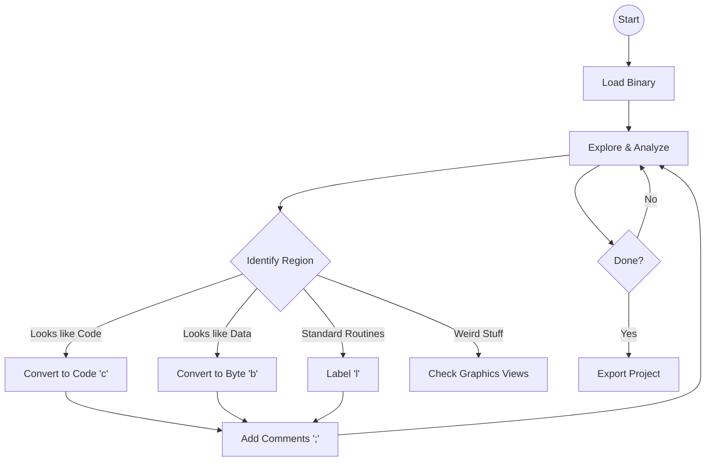

# Tutorial

Welcome to the **Regenerator 2000** tutorial. This guide will walk you through a typical reverse engineering session, transforming a raw binary into a comprehensible, labeled, and commented disassembly project.

!!! tip "Prerequisites"

    Ensure you have installed Regenerator 2000 and have a C64 program (`.prg`) ready to analyze.

---

## The Workflow

Reverse engineering is an iterative process. You start with a "blob" of unknown data and gradually carve out meaning, identifying code, graphics, and data tables until the picture becomes clear.



---

## Phase 1: First Contact & Navigation

Launch Regenerator 2000 with your target file:

```bash
regenerator2000 my_game.prg
```

You are now in the **Disassembly View**. The interface might look overwhelming at first, but it's simpler than it appears.

- **Grey text**: Bytes that are "unknown" (not yet analyzed).
- **White text**: Valid 6502 instructions.
- **Addresses (Left)**: The memory location of each line.

### Basic Movement

- **Scroll**: Use `Arrow Keys` or `Page Up` / `Page Down`.
- **Jump to Address**: Press `Ctrl+g`, type an address (e.g., `c000` or `$c000`), and hit `Enter`.
- **Follow Flow**: Highlighting a `JMP` or `JSR` instruction? Press `Enter` to jump to its target.
- **Go Back**: Press `Backspace` to return to where you were before the jump.

---

## Phase 2: Defining Code and Data

Your primary job is to tell Regenerator 2000 what is **Code** and what is **Data**.

### Converting to Code

You might see a block of bytes that looks like this:

```
$C000  A9 00 85 D0 ...
```

If you suspect this is code, place your cursor on the line and press:

> ++c++ (Convert to Code)

Regenerator 2000 will disassemble the bytes starting from that location. It will follow the code flow (jumps and branches) to automatically disassemble reachable instructions.

### Converting to Data

Sometimes, the disassembler might misinterpret data as code (creating "illegal opcodes" or nonsensical instructions like `BRK`). Or you might find a block of graphics data.

To mark a region as raw bytes:

1.  **Select the region**:
    - Press `Shift+v` to enter **Visual Mode**.
    - Use `Arrow Keys` to highlight the rows.
2.  **Convert**:
    - Press `b` to convert to **Bytes** (`.byte $00, $01...`).
    - Press `w` to convert to **Words** (`.word $1000...`).

---

## Phase 3: The Detective Work (Labels & X-Refs)

As you analyze the code, you'll recognize patterns. For example, you might see a call to `$D020` (Border Color).

### Creating Labels

Instead of remembering `$C015` is "Main Loop", give it a name!

1.  Move cursor to `$C015`.
2.  Press `l` (Label).
3.  Type `main_loop` and hit `Enter`.

Now, every instruction that jumps to `$C015` will read `JMP main_loop` instead of `JMP $C015`.

### Using Cross-References (X-Refs)

Regenerator 2000 automatically tracks **X-Refs**. If you are at a subroutine `draw_sprite`, you can see exactly _who_ calls this function.

- Look for the `X-Ref` section in the info panel (or press `Ctrl+x` to jump between references).
- This is crucial for understanding _how_ a function is used.

---

## Phase 4: Adding Context (Comments)

Code tells you _what_ passes, comments tell you _why_.

### Side Comments

Good for short notes on a specific line.

- Press `;` (semicolon).
- Type: `Update score counter`.
- Result: `INC $D020  ; Update score counter`

### Line Comments

Good for section headers or detailed explanations.

- Press `:` (colon).
- Type: `--- INIT ROUTINE ---`.
- Result: The comment appears on its own line _above_ the instruction.

---

## Phase 5: Visuals (Graphics & Tables)

Some data isn't code or numbers—it's art.

- **Sprites**: Press `Alt+3` to open the **Sprite View**. If you see a Space Invader, you've found the sprite data! Select that memory range and mark it as specific data (or keep it as bytes).
- **Charset**: Press `Alt+4` to check for custom fonts.
- **Screens**: Press `Alt+5` for the **Bitmap View** to see if a memory block forms a valid image.

Knowing _where_ graphics are helps you avoid trying to disassemble them as code.

---

## Phase 6: Saving & Exporting

### Saving Your Work

Reverse engineering takes time. Save your progress often.

- Press `Ctrl+s`.
- This creates a `.regen2000proj` file. It saves your labels, comments, formatting, and history.

### Exporting to Assembler

Once you are done (or want to test your changes), export the project to a source file (`.asm`) compatible with modern assemblers like 64tass or ACME.

- Press `Ctrl+e`.

### Exporting for Debugging (VICE)

Want to step through your code in the VICE emulator with your new labels?

- Go to **Menu** (`F10`) -> **File** -> **Export VICE labels...**.
- Load this labels file in VICE to see `main_loop` in the emulator's monitor!

---

## Summary of Key Keys

| Key         | Action                        |
| ----------- | ----------------------------- |
| `c`         | **C**ode                      |
| `b`         | **B**yte                      |
| `l`         | **L**abel                     |
| `;`         | Side Comment                  |
| `:`         | Line Comment                  |
| `Enter`     | Follow Jump / Jump to Operand |
| `Backspace` | Go Back                       |

Happy Hacking!
