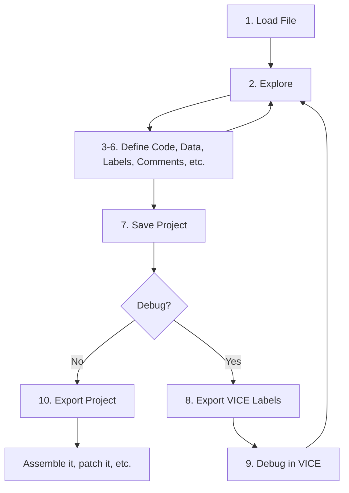

# Tutorial

A typical Regenerator 2000 workflow looks like the following:



1.  **Load a file**: Start by loading a program:
    ```bash
    regenerator2000 my_game.prg
    ```
2.  **Explore**: Use the arrow keys or ++page-up++/++page-down++ to scroll. Press ++enter++ on any
    `JMP` or `JSR` operand to follow the code flow and jump to that address. Press ++backspace++
    to return to where you were.
3.  **Define Code**: As you explore, you might find bytes marked as data that look like code.
    Move the cursor there and press ++c++ to disassemble them into instructions.
4.  **Define Data**: Conversely, if you see "code" that looks like garbage (illegal opcodes or nonsense instructions),
    it's likely graphics or tables. Select the lines (using ++shift+v++ and arrows) and press ++b++ to mark them as bytes.
5.  **Labels**: When you identify a subroutine (e.g., a music player init), press ++l++ on its start address
    to give it a name like `init_music`. This name will automatically appear everywhere that address is referenced.
6.  **Comments**: Select a line and press ++semicolon++ to add a side comment explaining what the code does.
    Or press ++colon++ to add a line comment.
7.  **Save Project**: Press ++ctrl+s++ to save your work. This creates a project file
    that preserves all your labels, comments, and formatting.
8.  **Export VICE Labels** (Optional): If you want to debug the program in VICE using your new labels,
    use the "Export VICE labels..." menu option. This generates a label file.
9.  **Debug it with VICE with the new labels** (Optional): Load your program and the generated label file in the VICE emulator
    to see your variable names and subroutine names in the VICE monitor. Use this insight to understand the code better,
    then go back to **Step 2** to refine your disassembly.
10. **Export Project**: Finally, where you are done disassembling, you can export the project
    to a file that can be used by an assembler. Press ++ctrl+e++ to export the project.
