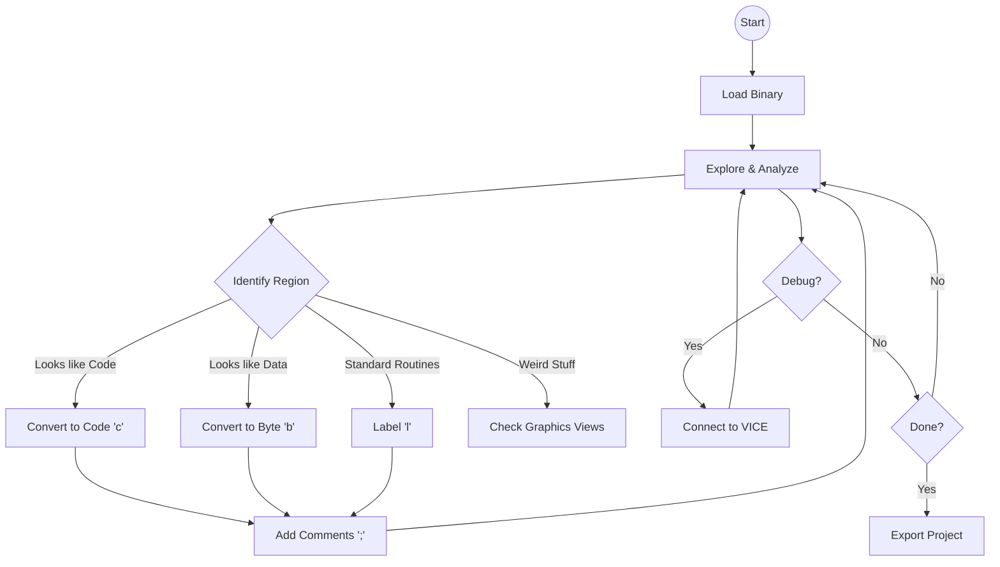

# Tutorial

Welcome to the **Regenerator 2000** tutorial. This guide will walk you through a complete reverse engineering session,
transforming a raw binary into a comprehensible, labeled, and commented disassembly project.

!!! tip "Prerequisites"

    Ensure you have installed Regenerator 2000 and have a C64 program (`.prg`) ready to analyze.

---

## The Workflow

Reverse engineering is an iterative process. You start with a "blob" of unknown data and gradually carve out meaning,
identifying code, graphics, and data tables until the picture becomes clear.


```mermaid
flowchart TD
    Start((Start)) --> Load[Load Binary]
    Load --> Explore[Explore & Analyze]
    Explore --> Define{Identify Region}
    Define -- "Looks like Code" --> Code[Convert to Code 'c']
    Define -- "Looks like Data" --> Data[Convert to Byte 'b']
    Define -- "Standard Routines" --> Label[Label 'l']
    Define -- "Weird Stuff" --> Graphics[Check Graphics Views]
    Code --> Comment[Add Comments ';']
    Data --> Comment
    Label --> Comment
    Comment --> Explore
    Explore --> Debug{Debug?}
    Debug -- Yes --> VICE[Connect to VICE]
    VICE --> Explore
    Debug -- No --> Finish{Done?}
    Finish -- No --> Explore
    Finish -- Yes --> Export[Export Project]
```

---

## Phase 1: First Contact & Navigation

Launch Regenerator 2000 with your target file:

```bash
regenerator2000 my_game.prg
```

You are now in the **Disassembly View**. The interface might look overwhelming at first, but it's simpler than it
appears.

- **Grey text**: Bytes that are "unknown" (not yet analyzed).
- **White text**: Valid 6502 instructions.
- **Addresses (Left)**: The memory location of each line.

### Basic Movement

- **Scroll**: Use ++arrow-up++ / ++arrow-down++ or ++page-up++ / ++page-down++ keys.
- **Jump to Address**: Press ++ctrl+g++, type an address (e.g., `c000` or `$c000`), and hit `Enter`.
- **Follow Flow**: Highlighting a `JMP` or `JSR` instruction? Press `Enter` to jump to its target.
- **Go Back**: Press `Backspace` to return to where you were before the jump.

### Auto-Analysis

When you first load a file, Regenerator 2000 automatically analyzes the binary (if enabled in Settings). It will:

- Trace code flow from known entry points.
- Create labels for subroutines (`sXXXX`), jump targets (`jXXXX`), and branch targets (`bXXXX`).
- Build cross-references so you can see _who_ calls _what_.
- Identify system addresses (KERNAL, I/O registers, etc.) based on the selected platform.

If auto-analyze is disabled, you can trigger it manually with ++ctrl+a++.

---

## Phase 2: Defining Code and Data

Your primary job is to tell Regenerator 2000 what is **Code** and what is **Data**.

### Converting to Code

You might see a block of bytes that looks like this:

```
$C000  A9 00 85 D0 ...
```

If you suspect this is code, place your cursor on the line and press: ++c++.

Regenerator 2000 will disassemble the bytes starting from that location. It will follow the code flow (jumps and
branches) to automatically disassemble reachable instructions.

### Converting to Data

Sometimes, the disassembler might misinterpret data as code (creating "illegal opcodes" or nonsensical instructions like
`BRK`). Or you might find a block of graphics data.

To mark a region as raw bytes:

1.  **Select the region**:
    - Press ++shift+v++ to enter **Visual Mode**.
    - Use `Arrow Keys` to highlight the rows.
2.  **Convert**:
    - Press ++b++ to convert to **Bytes** (`.byte $00, $01...`).
    - Press ++w++ to convert to **Words** (`.word $1000...`).

### Using Visual Mode Effectively

Visual Mode (++shift+v++) is essential for working with ranges of data. Once in Visual Mode:

- **Extend selection**: Use ++arrow-up++ / ++arrow-down++ or ++j++ / ++k++ to grow the selection.
- **Apply block type**: Press any block-type key (++c++, ++b++, ++w++, ++a++, ++p++, ++s++, etc.) to convert the entire
  selected region.
- **Exit**: Press ++escape++ to leave Visual Mode without making changes.

!!! tip "When to Use Visual Mode"

    - Marking large data tables as bytes or words.
    - Selecting a range of addresses for a Lo/Hi table (++less-than++ or ++greater-than++).
    - Converting a block of known text to PETSCII (++p++) or Screencode (++s++).

---

## Phase 3: The Detective Work (Labels & X-Refs)

As you analyze the code, you'll recognize patterns. For example, you might see a call to `$D020` (Border Color).

### Creating Labels

Instead of remembering `$C015` is "Main Loop", give it a name!

1.  Move cursor to `$C015`.
2.  Press ++l++.
3.  Type `main_loop` and hit `Enter`.

Now, every instruction that jumps to `$C015` will read `JMP main_loop` instead of `JMP $C015`.

### Using Cross-References (X-Refs)

Regenerator 2000 automatically tracks **X-Refs**. If you are at a subroutine `draw_sprite`, you can see exactly _who_
calls this function.

- Look for the `X-Ref` section in the side comments (e.g., `; x-ref: $0820, $0850`).
- Press ++ctrl+x++ to open the **Find References** dialog and navigate between all references.
- This is crucial for understanding _how_ a function is used.

### Go to Symbol

When you have many labels, finding the right one can be tedious. Press ++ctrl+p++ to open the **Go to Symbol** dialog.
Start typing a label name and the list will filter in real-time. Press ++enter++ to jump directly to the selected symbol.

---

## Phase 4: Adding Context (Comments)

Code tells you _what_ happens, comments tell you _why_.

### Side Comments

Good for short notes on a specific line.

- Press ++semicolon++ (semicolon).
- Type: `Update score counter`.
- Result: `INC $D020  ; Update score counter`

### Line Comments

Good for section headers or detailed explanations.

- Press ++colon++ (colon).
- Type: `--- INIT ROUTINE ---`.
- Result: The comment appears on its own line _above_ the instruction.
  ```asm
  ; --- INIT ROUTINE ---
  lda #$00
  ...
  ```

!!! tip "Multi-line and Separator Comments"

    - Use **++shift+enter++** or **++ctrl+j++** to insert a new line while in the comment dialog.
    - Use the following shortcuts within the dialog for quick formatting:
        - ++ctrl+minus++: Insert a line of dashes (`---`).
        - ++ctrl+plus++: Insert a line of equals signs (`===`).
        - ++ctrl+backslash++: Insert a mixed separator (`-=-`).

### Using Bookmarks

As your project grows, you'll want to quickly jump between key locations. Use bookmarks:

- ++ctrl+b++: Toggle a bookmark at the current address.
- ++ctrl+shift+b++ (or ++alt+b++): Open the Bookmarks dialog.

Bookmarks are saved with the project, so they persist across sessions.

---

## Phase 5: Searching

Regenerator 2000 offers several ways to search through the binary:

### Vim-style Search

Press ++slash++ and start typing. The disassembly will search for matches across labels, mnemonics, operands, and
comments. Press ++n++ to find the next match and ++shift+n++ for the previous match.

### Search Dialog

Press ++ctrl+f++ to open the full Search dialog, which supports:

- **Text search**: Search for labels, comments, and mnemonics.
- **Hex pattern search**: Search for specific byte sequences (e.g., `A9 00 8D` to find `LDA #$00; STA ...`).
  Use `??` as a wildcard for any byte.
- **PETSCII / Screencode search**: Find text strings in the data.

Use ++f3++ / ++shift+f3++ to jump to the next / previous match after closing the dialog.

---

## Phase 6: Visuals (Graphics & Tables)

Some data isn't code or numbers—it's art.

- **Hex Dump**: Press ++alt+2++ to view raw hex. Use ++m++ to cycle through text modes (PETSCII shifted/unshifted,
  Screencode shifted/unshifted) and look at the entropy column to spot compressed or encrypted regions.
- **Sprites**: Press ++alt+3++ to open the **Sprite View**. If you see a Space Invader, you've found the sprite data!
  Select that memory range and mark it as bytes.
- **Charset**: Press ++alt+4++ to check for custom charsets.
- **Bitmap**: Press ++alt+5++ for the **Bitmap View** to see if a memory block forms a valid image.

Knowing _where_ graphics are helps you avoid trying to disassemble them as code.

!!! tip "Syncing Views"

    When "Sync" is enabled (in Settings), moving the cursor in the Disassembly View automatically updates the right
    pane to show the corresponding memory location. This is very useful for switching between disassembly and hex
    dump to cross-check your analysis.

---

## Phase 7: Organizing with Splitters & Collapsed Blocks

As your disassembly grows, keeping things tidy becomes important.

### Splitters

Adjacent blocks of the same type are automatically merged. If you want to keep two blocks separate (e.g., two
different Lo/Hi tables), insert a **splitter** by pressing ++pipe++ between them. Line comments (++colon++) also act
as splitters.

### Collapsing Blocks

Press ++ctrl+k++ on a block to collapse it into a single summary line. This is great for hiding large data tables
or fully analyzed subroutines so you can focus on the area you're currently working on.

Collapsed blocks are a **visual-only** feature — they don't affect the exported ASM output.

---

## Phase 8: Saving & Exporting

### Saving Your Work

Reverse engineering takes time. Save your progress often.

- Press ++ctrl+s++.
- This creates a `.regen2000proj` file. It saves your labels, comments, formatting, bookmarks, and history.

### Exporting to Assembler

Once you are done (or want to test your changes), export the project to a source file (`.asm`) compatible with modern
assemblers.

- Press ++ctrl+e++ to export.
- Choose the target assembler in **Document Settings** (++alt+d++) — supported options are **64tass**, **ACME**,
  **KickAssembler**, and **ca65**.

### Batch Processing (Headless Mode)

For scripting and automation, you can run Regenerator 2000 without the TUI:

```bash
# Load, auto-analyze, and export — all from the command line
regenerator2000 --headless --export_asm output.asm my_game.prg

# Override the assembler format (64tass, acme, ca65, kick)
regenerator2000 --headless --assembler acme --export_asm output.asm my_game.regen2000proj

# Import VICE labels and export
regenerator2000 --headless --import_lbl labels.lbl --export_asm output.asm my_game.prg
```

---

## Phase 9: Debugging with VICE

The most powerful way to test your analysis is by connecting Regenerator 2000 directly to a running VICE instance for
live debugging.

1.  **Start VICE**: Start the emulator with the remote monitor enabled:

    ```bash
    x64 -binarymonitor my_game.prg
    ```

2.  **Connect**: In Regenerator 2000, go to **Debugger → Connect to VICE...** (`localhost:6502`).

    !!! tip "Auto-connect with `--vice`"

        You can skip this step by launching Regenerator 2000 with `--vice localhost:6502`. It will connect
        automatically at startup:

        ```bash
        regenerator2000 --vice localhost:6502 my_game.prg
        ```

3.  **View**: Open the **Debugger** panel with ++alt+6++ (or ++ctrl+6++) to see the current PC, registers, and
    breakpoints.

!!! warning

    Both VICE and Regenerator 2000 must be running the **same binary**. If the binaries are different, breakpoints
    and the PC display will be misaligned.

### Debugging Features

- **Breakpoints**: Use ++f2++ (or ++shift+f2++) to toggle breakpoints or ++f6++ for watchpoints directly at the cursor.
- **Stepping**: Use ++f7++ (Step Instruction), ++f8++ (Step Over), or ++shift+f8++ (Step Out).
- **Control**: Use ++f9++ to resume or ++f4++ to run until the cursor's location.

### Debugging Workflow

A typical debugging workflow looks like:

1. Set a breakpoint at a suspicious routine (++f2++).
2. Run the program in VICE (++f9++ or press play in VICE).
3. When execution hits the breakpoint, examine the registers and stack in the Debugger panel.
4. Step through the code (++f7++) to understand the logic.
5. Based on what you learn, go back to the Disassembly View and refine your labels and comments.

!!! note "Legacy Workflow: Export VICE Labels"

    If you'd rather use the VICE monitor alone, you can still export your project's labels using **File → Export VICE
    labels...**. However, for the best experience, we recommend using the integrated **VICE Debugger**.

---

## Phase 10: AI-Assisted Analysis (MCP)

Regenerator 2000 includes an MCP (Model Context Protocol) server that lets AI assistants help you analyze the binary
programmatically.

### Quick Start

1. Start Regenerator 2000 with the MCP server: `regenerator2000 --mcp-server my_game.prg`
2. Connect your MCP-compatible AI client to `http://localhost:3000`.
3. The AI can now read the disassembly, set labels, add comments, and manipulate blocks.

This is especially useful for:

- Batch-labeling known routines and I/O registers.
- Getting explanations of unfamiliar code patterns.
- Automating repetitive tasks across large binaries.

See [MCP Integration](mcp.md) for the full list of available tools and resources.

---

## Summary of Key Keys

| Key               | Action                               |
| :---------------- | :----------------------------------- |
| ++c++             | **C**ode                             |
| ++b++             | **B**yte                             |
| ++w++             | **W**ord                             |
| ++a++             | **A**ddress                          |
| ++r++             | Create Scope                         |
| ++l++             | **L**abel                            |
| ++semicolon++     | Side Comment                         |
| ++colon++         | Line Comment                         |
| ++d++             | Cycle Immediate Format (hex/dec/bin) |
| ++open-bracket++  | Pack Lo/Hi Address                   |
| ++shift+v++       | Visual Mode (selection)              |
| ++enter++         | Follow Jump / Jump to Operand        |
| ++backspace++     | Go Back                              |
| ++ctrl+g++        | Jump to Address                      |
| ++ctrl+p++        | Go to Symbol                         |
| ++ctrl+x++        | Find Cross-References                |
| ++slash++         | Search                               |
| ++ctrl+b++        | Toggle Bookmark                      |
| ++ctrl+k++        | Collapse / Uncollapse Block          |
| ++pipe++          | Toggle Splitter                      |
| ++ctrl+s++        | Save Project                         |
| ++ctrl+e++        | Export to ASM                        |
| ++f2++            | Toggle Breakpoint                    |
| ++f7++ / ++f8++   | Step Into / Step Over                |
| ++f9++            | Run / Continue                       |

Happy Hacking!
