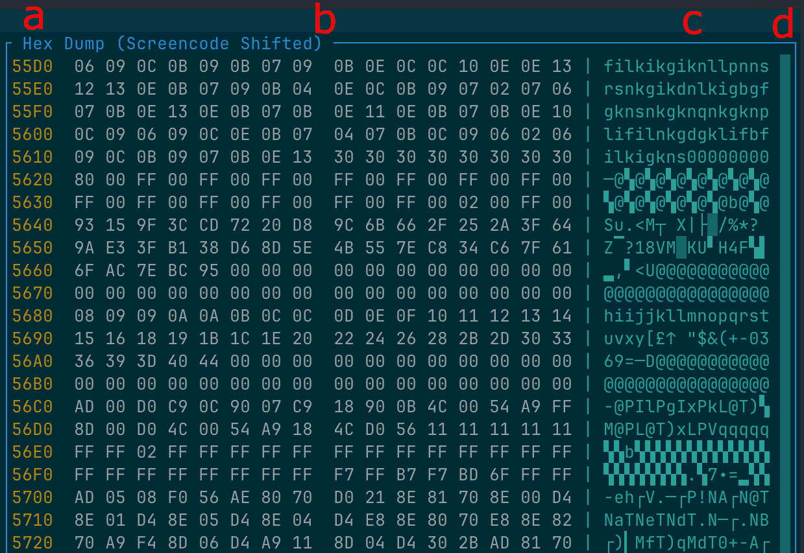

# Views

Regenerator 2000 offers several specialized views to efficiently analyze and reverse engineer your C64 binaries.

## Disassembly View

The Disassembly View is the central workspace of Regenerator 2000. It shows the disassembled code, data, and text, offering a comprehensive interface for reverse engineering.

In this view, you can:

- **Navigate Memory**: Move through the address space, jump to specific addresses or labels, and follow code execution flows.
- **Define Block Types**: Classify memory regions as Code, Byte data, Word data, or various Text formats to make sense of the binary.
- **Annotate**: Add comments to lines or specific instructions and rename labels to something meaningful.
- **Analyze Flow**: Visual indicators show jump and branch targets, helping you understand the program's logic.

### Keyboard Shortcuts

| Action | Shortcut |
| :--- | :--- |
| **Convert to Code** | ++c++ |
| **Convert to Byte** | ++b++ |
| **Convert to Word** | ++w++ |
| **Convert to Address** | ++a++ |
| **Convert to PETSCII Text** | ++p++ |
| **Convert to Screencode Text** | ++s++ |
| **Convert to Undefined** | ++question-mark++ |
| **Set Label** | ++l++ |
| **Add Side Comment** | ++semicolon++ |
| **Add Line Comment** | ++colon++ |
| **Jump to Address** | ++ctrl+g++ or ++alt+g++ |
| **Jump to Operand** | ++enter++ |
| **Jump Back (History)** | ++backspace++ |

## Hexdump View

The Hexdump View provides a raw hexadecimal representation of the memory, side-by-side with an text representation. It is useful for inspecting data that hasn't been formatted yet or for verifying the exact byte values in a region.

This view supports different text decoding modes to help you spot strings in standard C64 formats. It also shows the entropy of the data, which can help you identify regions that are likely to contain compressed data.

The Hex Dump view has 4 columns:

* **a**: The address
* **b**: 16 byes of hex dump
* **c**: The text representation, that can be any of: "Screencode shifted", "Screencode unshifted", "PETSCII shifted", "PETSCII unshifted".
* **d**: The entropy of the data. The higher the value, the more randon it is. 

The entropy is represented by these characters:

* ` ` (Empty) for Low Entropy (< 2.0)
* `░` (Light shade) for Moderate Entropy (< 4.0)
* `▒` (Medium shade) for Mixed Entropy (< 6.0)
* `▓` (Dark shade) for High Entropy (< 7.5)
* `█` (Full block) for Very High Entropy (> 7.5)

And entropy is calculated in 1024-bytes blocks. So the character shown is the entropy of the previous 512 bytes starting at the address of the row, plus the following 512 bytes.

### Keyboard Shortcuts

| Action | Shortcut |
| :--- | :--- |
| **Convert to Byte** | ++b++ |
| **Next Text Mode** (Screencode/PETSCII) | ++m++ |
| **Previous Text Mode** | ++shift+m++ |
| **Jump to Disassembly** | ++enter++ |

## Charset View

The Charset View allows you to inspect memory as if it were a C64 character set (font). This is crucial for verifying if a memory region contains custom fonts.

- **Standard & Multicolor**: Toggle between standard hi-res characters and multicolor mode to see if the data makes sense as graphics.
- **Pattern Recognition**: Useful for spotting graphical data masquerading as code or raw bytes.

### Keyboard Shortcuts

| Action | Shortcut |
| :--- | :--- |
| **Convert to Byte** | ++b++ |
| **Toggle Multicolor** | ++m++ |
| **Jump to Disassembly** | ++enter++ |

## Sprites View

The Sprites View helps you find and analyze sprite data (hardware sprites).

- **64-byte Chunks**: Displays memory formatted as C64 sprites (24x21 pixels).
- **Multicolor Support**: Toggle multicolor mode to correctly view game characters and objects.
- **Identification**: Helps identifying player characters, enemies, and other game objects hidden in the binary.

### Keyboard Shortcuts

| Action | Shortcut |
| :--- | :--- |
| **Convert to Byte** | ++b++ |
| **Toggle Multicolor** | ++m++ |
| **Jump to Disassembly** | ++enter++ |

## Bitmap View

The Bitmap View renders memory as a bitmap image, allowing you to visualize large areas of memory as graphics.

- **Asset Discovery**: Useful for finding splash screens, background graphics, or loading screens.
- **Format Identification**: Can help identify the format of unknown large data blocks by visualizing patterns.
- **Screen RAM Overlay**: You can cycle through different Screen RAM addresses to see how colors apply to the bitmap data.

### Keyboard Shortcuts

| Action | Shortcut |
| :--- | :--- |
| **Convert to Byte** | ++b++ |
| **Toggle Multicolor** | ++m++ |
| **Next Screen RAM** | ++s++ |
| **Previous Screen RAM** | ++shift+s++ |
| **Screen RAM after Bitmap** | ++x++ |
| **Jump to Disassembly** | ++enter++ |

## Blocks View

The Blocks View visualizes the memory layout of your project as a contiguous map. It helps you quickly identify:

- **Code regions** (Blue)
- **Data regions** (Green/Yellow)
- **Undefined/Unknown regions** (Grey)

This bird's-eye view is essential for understanding the overall structure of the binary, finding gaps, and spotting large chunks of unanalyzed data. You can click on any block to jump to that location in the Disassembly View.

### Keyboard Shortcuts

| Action | Shortcut |
| :--- | :--- |
| **Toggle Collapsed Block** | ++ctrl+k++ |
| **Jump to Disassembly** | ++enter++ |

