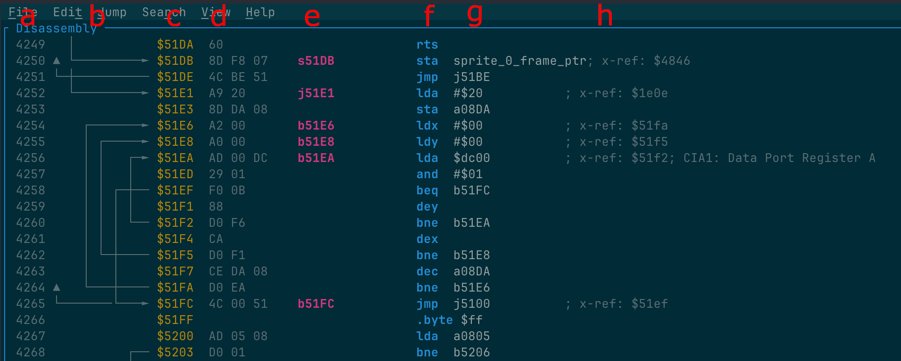
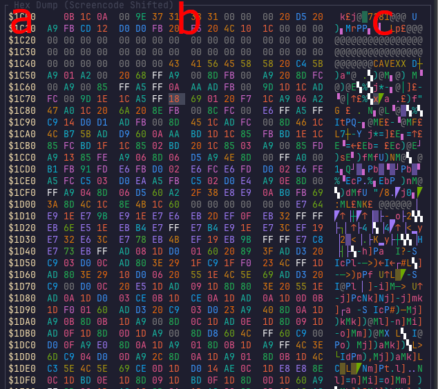
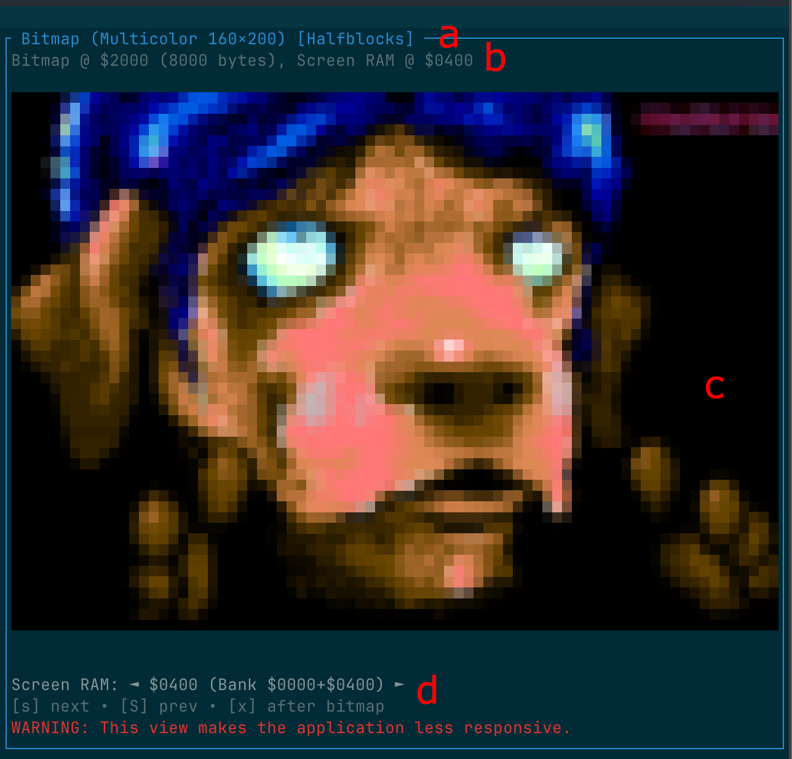

# Views

Regenerator 2000 offers several specialized views to efficiently analyze and reverse engineer your C64 binaries.

## Disassembly View

The Disassembly View is the central workspace of Regenerator 2000. It shows the disassembled code, data, and text,
offering a comprehensive interface for reverse engineering.

In this view, you can:

- **Navigate Memory**: Move through the address space, jump to specific addresses or labels, and follow code execution
  flows.
- **Define Block Types**: Classify memory regions as Code, Byte data, Word data, or various Text formats to make sense
  of the binary.
- **Annotate**: Add comments to lines or specific instructions and rename labels to something meaningful.
- **Analyze Flow**: Visual indicators show jump and branch targets, and unexplored code blocks are dimmed for visual
  clarity.
- **Minimap Bar**: A horizontal bar at the top of the main view (below the menu) shows a high-level overview of block
  types across the entire address space. It uses sub-character precision and allows mouse interaction for navigation.

The Disassembly view consists of:

- **a**: The line number, in decimal. Each line has its own unique number.
- **b**: The arrows, that indicate code flow.
- **c**: The address, in hexadecimal.
- **d**: The bytes, in hexadecimal.
- **e**: A possible label, which has different prefix (see below).
- **f**: The mnemonic. E.g. `lda`
- **g**: The operand. E.g.: `#$05`
- **h**: A side comment. E.g.: `; this is a comment`

Auto-generated labels use a short prefix to indicate how the address is referenced (e.g., `s_` for subroutine
targets, `j_` for jumps, `a_` for absolute addresses). See [Analysis — Label Prefixes](analysis.md#label-prefixes)
for the complete prefix reference.

### Keyboard Shortcuts

| Action                         | Shortcut                      |
|:-------------------------------|:------------------------------|
| **Disassemble address**        | ++d++                         |
| **Convert to Code**            | ++c++                         |
| **Convert to Byte**            | ++b++                         |
| **Convert to Word**            | ++w++                         |
| **Convert to Address**         | ++a++                         |
| **Convert to PETSCII Text**    | ++p++                         |
| **Convert to Screencode Text** | ++s++                         |
| **Convert to External File**   | ++e++                         |
| **Convert to Undefined**       | ++question-mark++             |
| **Set Lo/Hi Address Table**    | ++less-than++                 |
| **Set Hi/Lo Address Table**    | ++greater-than++              |
| **Set Lo/Hi Word Table**       | ++comma++                     |
| **Set Hi/Lo Word Table**       | ++period++                    |
| **Create Scope**               | ++r++                         |
| **Remove Scope**               | ++delete++                    |
| **Nudge Scope Boundary**       | ++alt+up++ / ++alt+down++     |
| **Set Label**                  | ++l++                         |
| **Add Side Comment**           | ++semicolon++                 |
| **Add Line Comment**           | ++colon++                     |
| **Next/Prev Immediate Format** | ++i++ / ++shift+i++           |
| **Pack Lo/Hi Address**         | ++open-bracket++              |
| **Pack Hi/Lo Address**         | ++close-bracket++             |
| **Toggle Visual Mode**         | ++shift+v++                   |
| **Toggle Splitter**            | ++pipe++                      |
| **Toggle Collapsed Block**     | ++ctrl+k++                    |
| **Toggle Bookmark**            | ++ctrl+b++                    |
| **List Bookmarks**             | ++ctrl+shift+b++ or ++alt+b++ |
| **Analyze**                    | ++ctrl+a++                    |
| **Jump to Address**            | ++ctrl+g++ or ++alt+g++       |
| **Jump to Operand**            | ++enter++                     |
| **Jump Back (History)**        | ++backspace++                 |
| **Search**                     | ++slash++                     |
| **Find Next**                  | ++n++                         |
| **Find Previous**              | ++shift+n++                   |

## Blocks View

The Blocks View visualizes the memory layout of your project as a contiguous map. It helps you quickly identify:

- **Code regions** (Blue)
- **Data regions** (Green/Yellow)
- **Undefined/Unknown regions** (Grey)

This bird's-eye view is essential for understanding the overall structure of the binary, finding gaps, and spotting
large chunks of unanalyzed data. You can click on any block to jump to that location in the Disassembly View.

### Keyboard Shortcuts

| Action                     | Shortcut   |
|:---------------------------|:-----------|
| **Toggle view**            | ++alt+1++  |
| **Toggle Collapsed Block** | ++ctrl+k++ |
| **Jump to Disassembly**    | ++enter++  |

## Hexdump View

The Hexdump View provides a raw hexadecimal representation of the memory, side-by-side with a text representation. It is
useful for inspecting data that hasn't been formatted yet or for verifying the exact byte values in a region.

This view supports three layout columns: **wide (16-byte)**, **narrow (8-byte)**, and **disabled** (hidden). You can
cycle through these modes using the **Cycle view** shortcut (++alt+2++ or ++ctrl+2++).

This view supports different text decoding modes to help you spot strings in standard C64 formats. Bytes are colored
using a **byte-value color palette** (based
on [Color-code your bytes](https://simonomi.dev/blog/color-code-your-bytes/)) for improved visual pattern recognition,
making it easier to spot repeating values or data structures.

<figure>
  
  <figcaption>16-byte hexdump</figcaption>
</figure>

<figure>
  
  <figcaption>8-byte hexdump</figcaption>
</figure>

The Hex Dump view consists of:

- **a**: The address
- **b**: 16 bytes or 8 bytes of hex dump
- **c**: The text representation, that can be any of: "Screencode shifted", "Screencode unshifted", "PETSCII shifted", "
  PETSCII unshifted".

### Keyboard Shortcuts

| Action                                   | Shortcut    |
|:-----------------------------------------|:------------|
| **Cycle view** (16-byte, 8-byte, hidden) | ++alt+2++   |
| **Convert to Byte**                      | ++b++       |
| **Next Text Mode** (Screencode/PETSCII)  | ++m++       |
| **Previous Text Mode**                   | ++shift+m++ |
| **Jump to Disassembly**                  | ++enter++   |

## Sprites View

The Sprites View helps you find and analyze sprite data (hardware sprites).

This view can be cycled through three layouts: **wide (2-sprites)**, **narrow (1-sprite)**, and **disabled** (hidden).
You can cycle through these modes using the **Cycle view** shortcut (++alt+3++ or ++ctrl+3++).

- **64-byte Chunks**: Displays memory formatted as C64 sprites (24x21 pixels).
- **Multicolor Support**: Toggle multicolor mode to correctly view game characters and objects.
- **Identification**: Helps identifying player characters, enemies, and other game objects hidden in the binary.

<figure>
  
  <figcaption>2-sprites view</figcaption>
</figure>

<figure>
  
  <figcaption>1-sprite view</figcaption>
</figure>

### Keyboard Shortcuts

| Action                                       | Shortcut  |
|:---------------------------------------------|:----------|
| **Cycle view** (2-sprites, 1-sprite, hidden) | ++alt+3++ |
| **Convert to Byte**                          | ++b++     |
| **Toggle Multicolor**                        | ++m++     |
| **Jump to Disassembly**                      | ++enter++ |

## Charset View

The Charset View allows you to inspect memory as if it were a C64 character set (font). This is crucial for verifying if
a memory region contains custom fonts.

This view can be cycled through three layouts: **wide (8-chars)**, **narrow (4-chars)**, and **disabled** (hidden). You
can cycle through these modes using the **Cycle view** shortcut (++alt+4++ or ++ctrl+4++).

- **Standard & Multicolor**: Toggle between standard hi-res characters and multicolor mode to see if the data makes
  sense as graphics.
- **Pattern Recognition**: Useful for spotting graphical data masquerading as code or raw bytes.

<figure>
  
  <figcaption>8-chars view</figcaption>
</figure>

<figure>
  
  <figcaption>4-chars view</figcaption>
</figure>

### Keyboard Shortcuts

| Action                                    | Shortcut  |
|:------------------------------------------|:----------|
| **Cycle view** (8-chars, 4-chars, hidden) | ++alt+4++ |
| **Convert to Byte**                       | ++b++     |
| **Toggle Multicolor**                     | ++m++     |
| **Jump to Disassembly**                   | ++enter++ |

## Bitmap View

The Bitmap View renders memory as a bitmap image, allowing you to visualize large areas of memory as graphics.

- **Asset Discovery**: Useful for finding splash screens, background graphics, or loading screens.
- **Format Identification**: Can help identify the format of unknown large data blocks by visualizing patterns.
- **Screen RAM Overlay**: You can cycle through different Screen RAM addresses to see how colors apply to the bitmap
  data.

!!! warning

    The Bitmap View is heavy on the CPU. It is recommended to hide it once you stop using it.

The Bitmap View consists of:

- **a**: Bitmap mode (Multicolor or High-Res) and how the bitmap is being rendered (HalfBlocks, iTerm2)
- **b**: The bitmap and screen RAM addresses. For multi-color mode, the Color RAM is fixed.
- **c**: The bitmap itself
- **d**: Screen RAM cycle indicator

### Keyboard Shortcuts

| Action                      | Shortcut    |
|:----------------------------|:------------|
| **Toggle view**             | ++alt+5++   |
| **Convert to Byte**         | ++b++       |
| **Toggle Multicolor**       | ++m++       |
| **Next Screen RAM**         | ++s++       |
| **Previous Screen RAM**     | ++shift+s++ |
| **Screen RAM after Bitmap** | ++x++       |
| **Jump to Disassembly**     | ++enter++   |

## Debugger View

The Debugger View integrates with the [VICE](https://vice-emu.sourceforge.io/) emulator to provide live debugging
capabilities without leaving Regenerator 2000.

Toggle the Debugger View with ++alt+6++ (or ++ctrl+6++). Once connected to VICE, the panel shows:

- **Connection status**: Whether Regenerator 2000 is connected to VICE and whether the emulator is running or stopped.
- **Live disassembly**: When the emulator is stopped, a small window of disassembly around the current PC, with the
  current instruction highlighted.
- **Registers**: A, X, Y, SP, and P (status) when available.
- **Breakpoints**: List of breakpoints set in VICE.
- **Watchpoints**: List of watchpoints set in VICE.

The main **Disassembly** view also reflects the debugger state when connected: the current PC is highlighted, and
breakpoints are indicated.

For more details on connecting to VICE and using the debugger, see [Debugger (VICE Integration)](debugger.md).

### Keyboard Shortcuts

| Action                   | Shortcut     |
|:-------------------------|:-------------|
| **Toggle view**          | ++alt+6++    |
| **Toggle Breakpoint**    | ++f2++       |
| **Toggle Breakpoint...** | ++shift+f2++ |
| **Run to Cursor**        | ++f4++       |
| **Watchpoint**           | ++f6++       |
| **Memory Dump...**       | ++m++        |
| **Step Instruction**     | ++f7++       |
| **Step Over**            | ++f8++       |
| **Step Out**             | ++shift+f8++ |
| **Run / Continue**       | ++f9++       |
